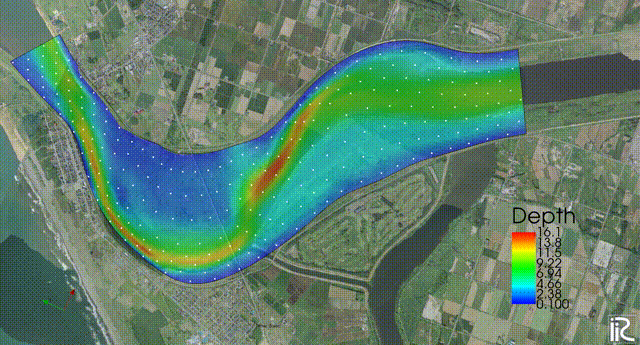

Introduction
============

UTT(Universal Tracer Tracker) is a tool to track and visualize 
the trajectory of various materials specified by the user using 
the calculation result of various flow calculation solvers 
implemented in iRIC. 
The target transported substance is not only completely following the flow, 
but also the substance itself has a cruising ability, a typical example is a fish,
by specifying its ability and characteristics to express its movement. 

The UTT determines the concentration (density) of the tracer particles at a given 
location in the fluid and it has the ability to clone or amalgamate itself as needed. 
This usually allows the tracer to be visualized the image in the detached area where particles 
cannot easily invade, or in the area where particles have accumulated and become extremely 
difficult to see.

In addition, UTT can also display weighted particle concentrations that take into account 
splitting and binding.  It is possible to analyze the concentration by a substantial Lagrangian method.

Note that the UTT can extract the turbulence below the grid scale modeled in 
the solvers by introducing a random walk model.
This allows to examine more realistic particle tracking and concentration diffusion fields.

Basically, there are three types of tracers to be tracked in UTT.

(1) Normal tracer (tracks only the position of particles)

(2) Special tracer (also records and displays the position of its trajectory)

(3) Fish tracer (a fish tracer that propels itself)

In addition to these, 
rod-like shape tracers such as driftwood tracers and can be tracked with their own movement and rotation

(4) Driftwood tracer, NaysDw2 (2D driftwood tracking solver), which is a separate solver from UTT. 

The computation of UTT is performed by the following procedure.

(1) Computation of flows with flow calculation solvers (Nays2dh, Nays2dFlood, Nays2d+, etc.)

(2) Saving of flow calculation results (CGNS file)

(3) Starting UTT

(4) Setting tracer input and tracking conditions

(5) Tracer tracking calculation using the above CGNS file.

(6) Visualization of the calculation results

.. figure:: images/yasu.png
   :align: center
   :width: 200pt
   :target: https://rivmodel.rivpac.com/

.. figure:: images/iric.jpg
   :align: center
   :width: 200pt
   :target: https://i-ric.org/

April 26th, 2021 
`Yasu <https://rivmodel.rivpac.com/>`_ and Jon

