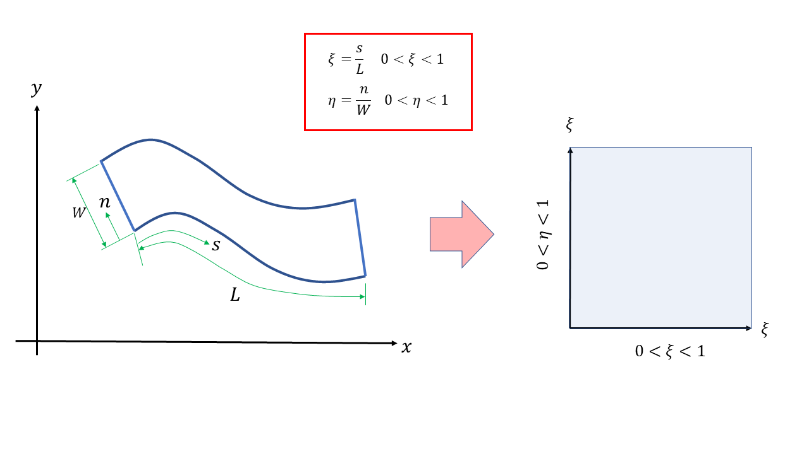
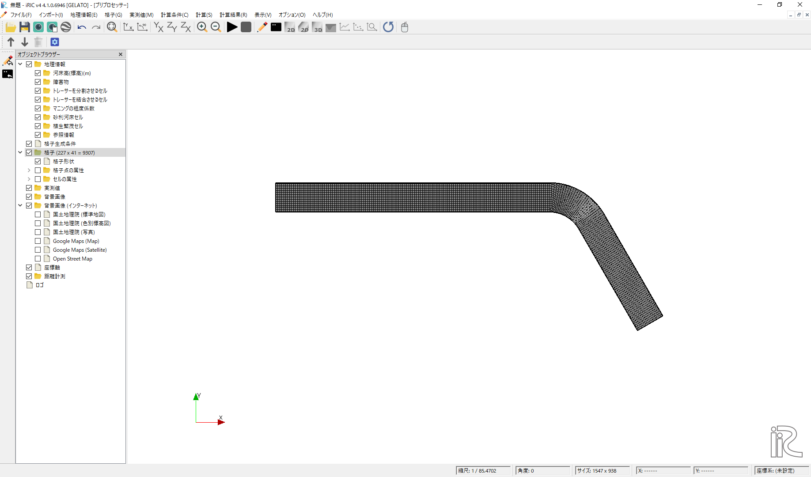

基本事項（共通事項）
====================

ここではGELATOモデルにおける基本事項に関して述べる。

.. _01_lavel_kijutsu:

GELATOにおけるトレーサーの位置情報の記述方法
----------------------------------------------

GELATOにおいて用いられるトレーサーの位置は流下方向および横断方向の無次元座標を用いて表される。
例えば、河川や水路で境界適合座標を用いた場合、:numref:`nondim` に示すよう、
水路下流方向に :math:`\xi`、横断方向に :math:`\eta` のいずれも0から1の範囲の
無次元パラメータでトレーサーの位置情報を表すことになる。

.. _nondim:

   :トレーサーの位置の無次元表示方法

乱流の影響を考慮したランダムウォークモデル
--------------------------------------------

Callies(2011)、McDonald and Nelson(2020)によれば、対象トレーサーの
位置ベクトル :math:`\boldsymbol{r}` は次式で表される。

 .. math:: 

    \boldsymbol{r}(t+\Delta t) = \boldsymbol{r}(t)+ \boldsymbol{U} \Delta t + 
    \boldsymbol{U}_p \Delta t + \boldsymbol{L}\sqrt{2K\Delta t}

ここで、 :math:`\boldsymbol{U}` は流れの流速ベクトル、:math:`\boldsymbol{U}_p` は
トレーサーの流速ベクトル(トレーサー自身の持つ推進速度ベクトル)、 :math:`\boldsymbol{L}` 
はその値が、平均値0で標準偏差1になるようなガウス分布ベクトル、:math:`\Delta t` 
は計算時間ステップ、:math:`K` は乱流拡散係数である。

:math:`\boldsymbol{L}` はBox-Muller変換 (Box and Muller, 1958)を適用すると、
2次元の場合は以下のように表される。

.. math:: 

    L_0 = (-2 \log U_1)^{1/2} \cos (2\pi U_2)

.. math:: 

    L_1 = (-2 \log U_1)^{1/2} \sin (2\pi U_2)

ここで、:math:`U_1` と :math:`U_2` は互いに独立な0～1の正規乱数であるり、これらを適用することにより、
ゆわゆるRandom Walkモデルとなる。:math:`K` 渦動粘性係数 :math:`\nu_t` の線形関数とし次式で与える。

.. math:: 

   K= a \nu_t + b

GELATOモデルでは、上式の :math:`a` および :math:`b` をパラメータとして与える。:math:`\nu_t` に関しては、
流れの計算結果から自動的に読み込まれる。

.. cloning00: 

トレーサーのクローニングについて
---------------------------------

上流から供給されるトレーサーは流れに乗って下流に輸送されるが、流れの状況によってはトレーサーが
十分に流れてこない領域が発生する。特に流れが淀む場所、剥離域、分流した場合の一方などでは、
上流から大量のトレーサーを供給しても、対象領域にはなかなか到達できない場合がある。
一般に、上流からの供給数には上限があり、無限に供給出来る分けではないので、何等かの工夫が必要になる。
そこでGELATOでは、トレーサーの数が少ないセル（もしくはトレーサーが存在しないセル）に新たなトレーサーを
発生させ（分割させ）トレーサーが十分に無い領域でも流れの様子を追跡しつつ、トレーサー濃度を管理する
という手法を採用している。例えば、

- あるセルでトレーサーの数が1個になったら、2分割させる.
- ただし、重みは1/2とし、これを記憶する
- Cloningは何度でも繰り返し可能とするが、所定の世代(Generation)で打ち切ることも可能とする
- オプションとして、トレーサーがゼロのセルには1個発生させることも可能とする。この場合のトレーサーの重みはゼロとするが、可視化は可能なので、流れの可視化用のトレーサーとしては有効となる。

トレーサーの分割の様子を模式的に :numref:`bunkatsu` に示す。

.. _bunkatsu:

.. figure:: images/02/bunkatsu.gif
   :width: 100%

   :トレーサーの分割（クローニングのイメージ）

最初に投入されたトレーサーを第1世代、初回の分割で発生したものを第2世代、その次を第3世代...
と定義すると、第2世代では重みは1/2、第3世代では重みが1/4、第 :math:`n` 世代では
:math:`2^{n-1}` 回の分割を経験していることを考慮すると、その重み :math:`W=\cfrac{1}{2^{n-1}}` 
となる。  これを利用して各セル内の重み付きトレーサーの重み付き総個数をカウントすることにより、
濃度の算定が可能となる。従って、たとえば第10世代では 
:math:`n=10` で :math:`W=\cfrac{1}{2^9}=0.000195`,
:math:`n=20` で :math:`W=\cfrac{1}{2^{19}}=0.00000195` となる。 

GELATOで使用される2次元流れの計算結果
---------------------------------------

GELATOでは2次元の「流れ」に乗ったトレーサーの追跡をラグランジェ的に行うので、「流れ」の計算結果は予め用意しておく
必要がある。GELATOではデフォルトで2次元構造格子の格子各点上で定義され、CGNSファイルとして保存
された2次元の流速場を読み込む。iRICのソルバーでこの条件を満たすソルバは現時点(2021年4月1日現在)
では、Nays2dH、Nays2dFlood、Nays2D+、FastMechである( :numref:`flow` )。
iRICで使用可能な流れの計算モデルについてはiRICのWebsite(https://i-ric.org/)を参照されたい。 

.. _flow:

.. figure:: images/02/flow.png
   :width: 100%

   : GELATOによる計算の流れ

GELATOで使用する流れの計算結果が格納されたCGNSファイルは
バーの「計算条件」「設定」「流れの計算結果を読み込むCGNSファイル」から指定する。
(:numref:`read_cgnsfile`)

.. _read_cgnsfile:

.. figure:: images/02/cgns_file.png
   :width: 600pt

   : 流れの計算結果が格納されたCGNSファイルの指定

GELATOで使用される計算格子
---------------------------

GELATOでは流れの計算結果にトレーサーを乗せてその軌跡の追跡を行うが、ほとんどの場合、
計算格子は前記の計算結果GNSファイルに含まれるものからインポートして使用する。
:numref:`import_grid` に示すように、「プリプロセッサー」ウィンドウの「オブジェクトブラウザ」
から、[格子(データ無し)]を右クリックし、[インポート]を選択した後に、
:numref:`import_grid_1` で格子情報を含むCGNSファイルを選ぶ。 
なお、iRICの場合は通常[Case1.cgn] というファイル名になっている。

.. _import_grid:

.. figure:: images/02/import_grid.png
   :width: 100%

   : GELATOで使用する計算格子を流れの計算結果CGNSファイルからインポートする。

.. _import_grid_1:

.. figure:: images/02/import_grid_1.png
   :width: 600pt

   : GELATOで使用する計算格子を流れの計算結果CGNSファイルを選ぶ

GELATOから流れの計算プロジェクトのCGNSファイルに含まれる格子データを読もうをすると、
:numref:`import_grid_2` のような警告が出る。これは、現在起動中のプロジェクトが
GELATOであるにも関わらず、別のプロジェクト（流れの計算プロジェクト）の格子
ファイルをインポートしようとしていることに対する警告であるが、構わず「OK」を
押して次へ進むと、:numref:`import_grid_3` のような対象の流れの計算結果から
格子がインポートされ、その結果が表示される。

.. _import_grid_2:

.. figure:: images/02/import_grid_2.png
   :width: 400pt

   : 警告メッセージ

.. _import_grid_3:

   : 格子インポートの完了

この後は下記の手順でGELATOによトレーサーの計算と結果の表示がおかなわれるが、
具体的には次節の事例集でその実例を示す。

・計算条件設定

・計算実行

・計算結果を表示
 