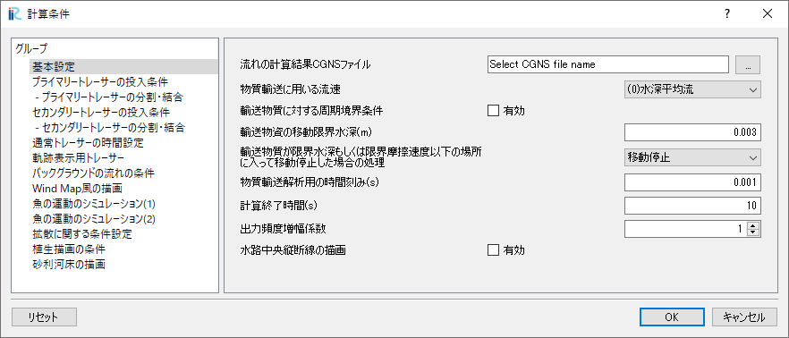
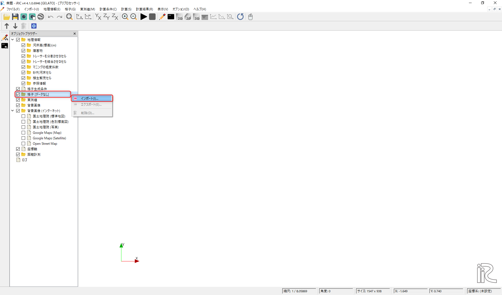
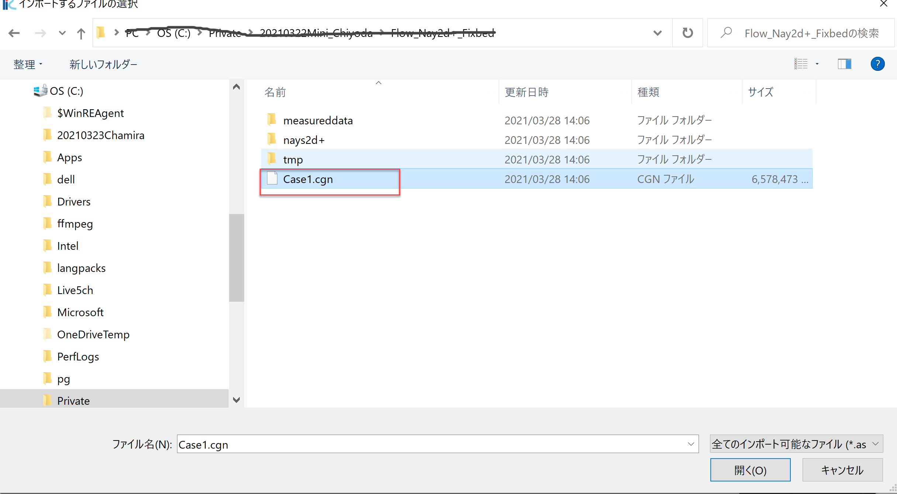
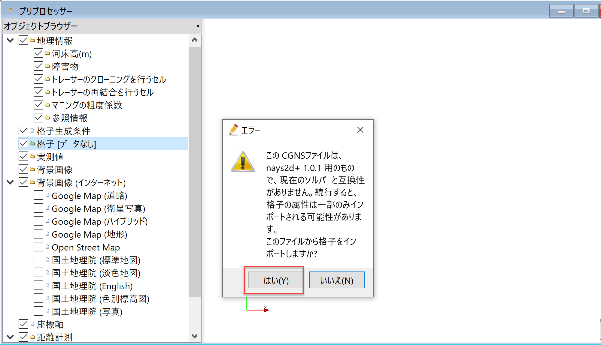

.. _Overview:

Overview
====================

In this section, we describe the basics of the GELATO model.

.. _01_lavel_kijutsu:

How to describe the locations of tracers
---------------------------------------------

The positions of the tracers used in the GELATO are represented using normalized
coordinates in the downstream and transverse directions.
For example, when boundary-fitted coordinates are used for rivers,
as shown in :numref:`nondim` , Non-dimensional coordinates of :math:`\xi` in the 
downstream direction, and :math:`\eta` in the transverse direction show the
location of the tracers using values between 0 to 1.

.. _nondim:

.. figure:: images/02/xi_eta.png
   :align: center
   :width: 400pt

   :Non-dimensional description of tracers' position

Random walk model considering the effect of turbulence
----------------------------------------------------------

According to Callies (2011), and McDonald and Nelson (2020), 
the target tracer's position vector :math:`\boldsymbol{r}` is expressed by the 
following equation

 .. math:: 

    \boldsymbol{r}(t+\Delta t) = \boldsymbol{r}(t)+ \boldsymbol{U} \Delta t + 
    \boldsymbol{U}_p \Delta t + \boldsymbol{L}\sqrt{2K\Delta t}

Where :math:`\boldsymbol{U}` is the velocity vector of the flow,
:math:`\boldsymbol{U}_p` is velocity vector of a tracer (the tracer's own propulsive velocity vector), 
:math:`\boldsymbol{L}` is a Gaussian vector whose values are such that it has mean 0 and standard deviation 1,
:math:`\Delta t` is the computation time step, and  :math:`K` is the turbulent diffusion coefficient.

Applying the Box-Muller transformation (Box and Muller, 1958) for :math:`\boldsymbol{L}` 
, the following equations are obtained for the two-dimensional case.

.. math:: 

    L_0 = (-2 \log U_1)^{1/2} \cos (2\pi U_2)

.. math:: 

    L_1 = (-2 \log U_1)^{1/2} \sin (2\pi U_2)

where :math:`U_1` and :math:`U_2` are mutually independent 0 to 1 normal random numbers.
This is the so-called Random Walk model, When these are applied for tracer tracking.
:math:`K` can be given as a linear function of :math:`\nu_t` as, 

.. math:: 

   K= a \nu_t + b

In the GELATO model, :math:`a` and :math:`b` in the above equation are given as parameters. 
As for  :math:`\nu_t` , it is automatically loaded from the result of the flow calculation.

.. _cloning00: 

Tracer cloning
---------------------------------

The tracer supplied from upstream is transported downstream by the flow, 
but depending on the flow conditions, the tracers may not be got into areas
particularly, in the place where the flow is stagnant, the separation zone, 
and the one of the paths where the flow is divided, etc, even if a large 
amount of tracer is supplied from upstream, it may not easily to reach 
the target region. 
In general, there is an upper limit to the number of feeds from the upstream, 
and it is not infinite, so some ingenuity is required.
In the GELATO, a new tracer can be added to a cell with a small number of tracers 
(or no tracers), to control the tracer concentration while tracking the flow 
even in areas where there is not enough tracer.  For example,

- When the number of tracers in a cell reaches one, split it into two
- But the weight is set to 1/2, and it is stored
- Cloning can be repeated as many times as necessary, but it can be terminated at a given generation.
- Optionally, a single tracer can be generated for cells with zero tracers. 

In this case the tracer The weights are assumed to be zero, but visualization is possible, 
so it is effective as a tracer for flow visualization.

:numref:`bunkatsu` shows the schematics of the tracer division.

.. _bunkatsu:

.. figure:: images/02/bunkatsu.gif
   :align: center
   :width: 400pt

   : Division of the tracer (image of cloning)

When defined as the first tracer submitted is the first generation, the one generated  
by the first split is the second generation, and the next one is the third generation...
The wight is 1/2 at the second generation, the weight is 1/2 in the third generation, 
and the weight is 1/4 in the fourth generation.  In the :math:`n` generation, considering 
it is experienced :math:`2^{n-1}` times cloning, it's weight becomes  :math:`W={1}/{2^{n-1}` .
Using this, we can count the total number of weighted tracers in each cell to 
obtain concentration can be calculated. 
Thus, for example, in the 10th generation when :math:`n=10` , weight is :math:`W=\cfrac{1}{2^9}=0.000195`,
and in the 20th generations when :math:`n=20`, the weight becomes :math:`W=\cfrac{1}{2^{19}}=0.00000195` .

Calculation results of two-dimensional flows used in GELATO
--------------------------------------------------------------

Since the GELATO tracks tracers in a two-dimensional "flow" in a Lagrangian manner, 
the results of the "flow" calculation have to be prepared in advance( :numref:`flow` ).
By default, the GELATO read the flow information stored in the CGNS files with 
2-dimensional structured grid format.  At present, flow solvers which satisfy this condition in iRIC
(as of April 1, 2021), are Nays2dH, Nays2dFlood, Nays2d+, and FastMech.
For more information about the flow calculation models available in iRIC, 
please visit the iRIC website (https://i-ric.org/) for more details.

.. _flow:

   : Calculation Procedure by GELATO

The CGNS file that contains the calculation results of 
the flow used in GELATO is Specify from [Calculation conditions], [Settings], 
and [CGNS file to load flow calculation results] of the bar.
(:numref:`read_cgnsfile`)

.. _read_cgnsfile:

   : Specify the CGNS file which contains the calculation result of the flow

Computational grids used in GELATO 
----------------------------------

In most cases, the computational grid is imported from the GNS files
which contains the computational flow results.
As shown in  :numref:`import_grid` , from the "Object Browser" in the "Pre-Preprocessing Window",
Right-click [Grid(No data)], select [Import], and select a 
CGNS file which contains the grid information as :numref:`import_grid_1` .
In most cases in iRIC, the file name is [Case1.cgn].

.. _import_grid:

   : Importing computational grid.

.. _import_grid_1:

   : Select a CGNS file 

When you try to read the grid data from CGNS file produced by other than GELATO,
:numref:`import_grid_2` is displayed.
This means that the current project(GELATO project) is different from the flow calculation project.
This is a warning that you are trying to import grids from a wrong project, 
but you can just click "OK", and the grid information is imported and the result is displayed 
as :numref:`import_grid_3` .    

.. _import_grid_2:

   : Warning message

.. _import_grid_3:

.. figure:: images/02/import_grid_3.png
   :align: center
   :width: 100%

   : Grid import completed

After this, the following procedure is used to calculate the tracer and display the result by GELATO. 
Examples are given in the next section.

- Set computational condition

- Calculation execution

- Visualization of the solution
 