====================================================
[Example 1] Tracer transport in a straight channel
====================================================

Flow calculation by Nays2DH
=================================

Select a solver
-------------------

In the [iRIC start page] , select [Create New Project], and when the [Select Solver] screen appears, 
choose [Nays2DH iRIC 3.x 1.0 64bit] and click [OK] button.

.. figure:: images/01/Select_Nays2dh.png
   :align: center
   :width: 80%

   : Select Solver

A windows with "Untitled - iRIC 3.x.xxxx [Nays2DH iRIC3X 1.0 64bit]" appears as :numref:`01_mudai`.

.. _01_mudai:

.. figure:: images/01/mudai.png 
   :align: center
   :width: 90%

   : Untitled

.. _01_lavel_koshi:

Grid Generation
-------------------

From the main menu of the screen, :numref:`01_mudai`, choose [Grid]->[Select Algorithm to Create Grid]
as :numref:`Select_Alg`.

.. _Select_Alg:

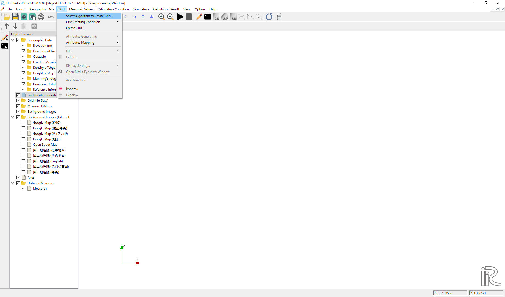

   : Select Algorithm to Create Grid

In the [Select Grid Creating Algorithm] window, 
select [Simple Straight and Meandering Channel Creator] and click [OK] 
(:numref:`01_kanni`).

.. _01_kanni:

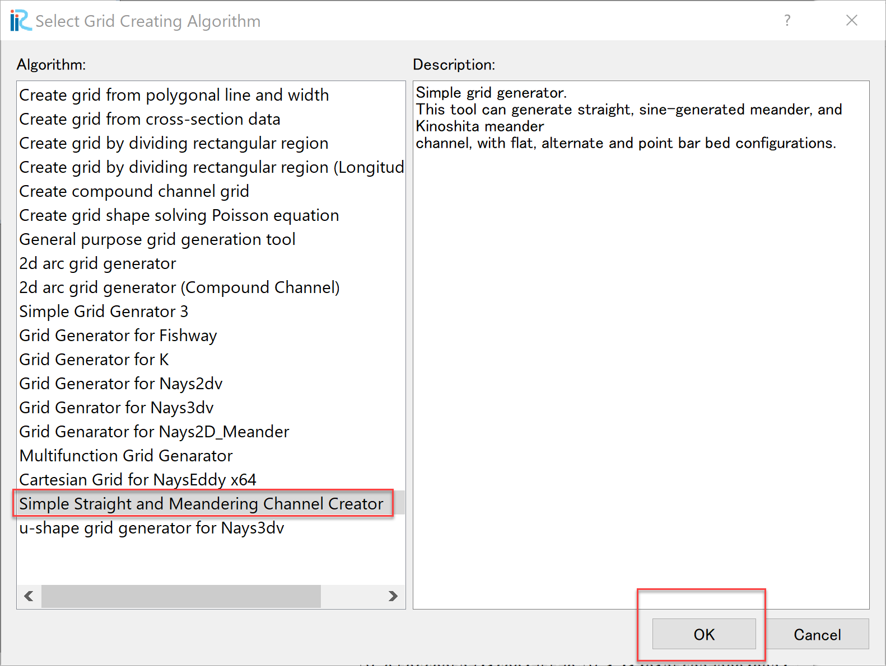

   : Select Grid Creating Algorithm

In the window of :numref:`01_koushi_1` ,
click "Channel Shape" and set [Select Channel Shape of the Main Part] as [straight channel],
and other values as shown in :numref:`01_koushi_1`, then click [Create Grid].

.. _01_koushi_1:

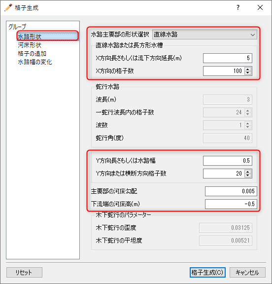

   :Setting Channel Shape

When the confirmation window appears as :numref:`01_koushi_3`, click [Yes] to generate the grid, 
then the computational grid is generated as 
:numref:`01_koushi_4` .

.. _01_koushi_3:

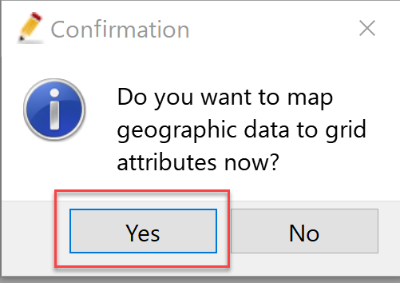

   :Confirmation of mapping

.. _01_koushi_4:

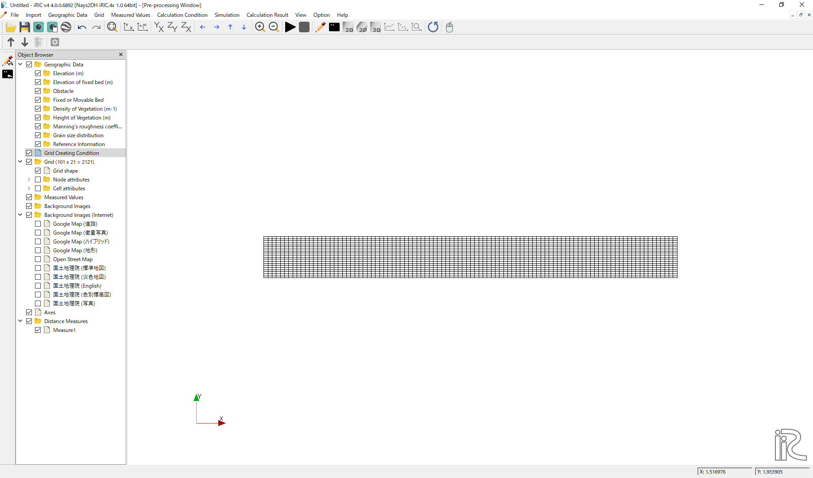

   :Grid Generation Compete

Setting of calculation conditions for flow by Nays2DH
-------------------------------------------------------

The next step is to set the calculation conditions. 
From the menu bar, select [Calculation Conditions]->[Settings], then 
the [Calculation condition setting window] as  :numref:`01_joken_1` appears.

.. _01_joken_1:

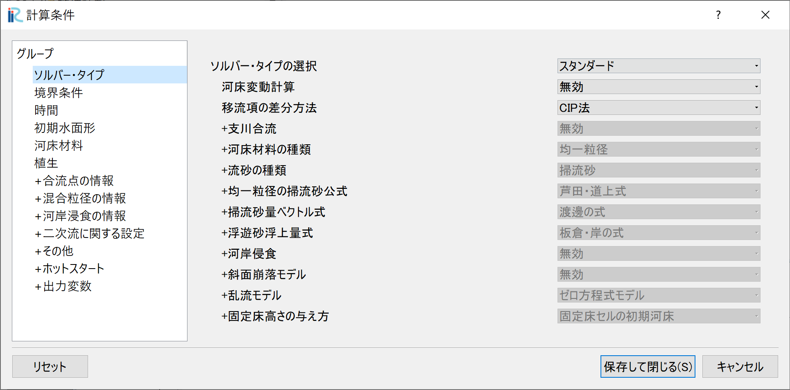

   :Calculation Condition Window

As :numref:`01_joken_2`, in the [Group] of the [Boundary Condition], 
click [Edit] at the [Time series of discharge at upstream and water level at downstream].
Then the [Time series of discharge at upstream and water level at downstream] appears
as :numref:`01_joken_3` . 

.. _01_joken_2:

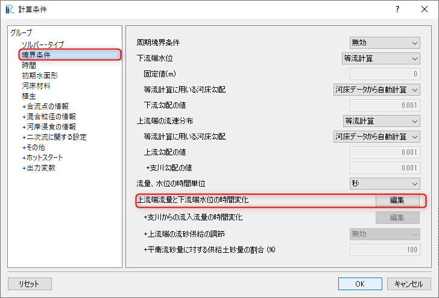

   : Boundary Condition

.. _01_joken_3:

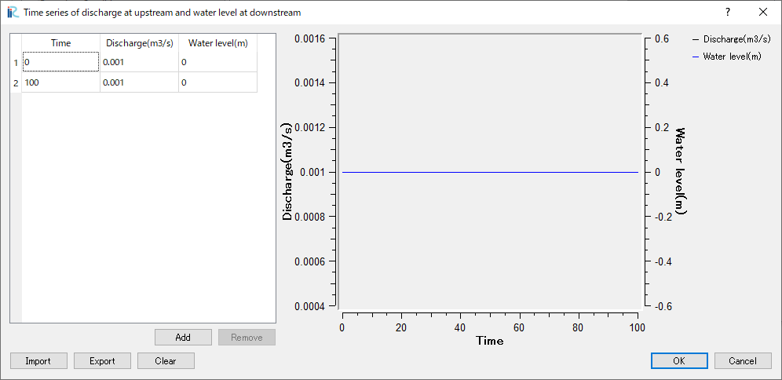

   : Time series of discharge at upstream settings

In :numref:`01_joken_3`, input [Time] and [Discharge] values, and click [OK]
when you finish, and close this window.

.. _01_joken_4:

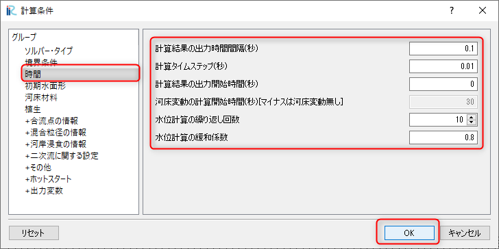

   :Time parameters

Select [Time] and set parameters as :numref:`01_joken_4` and click [Save and Close].

.. _res_Nays2DH:

Flow calculation run by Nays2DH
----------------------------------

.. _01_jikko:

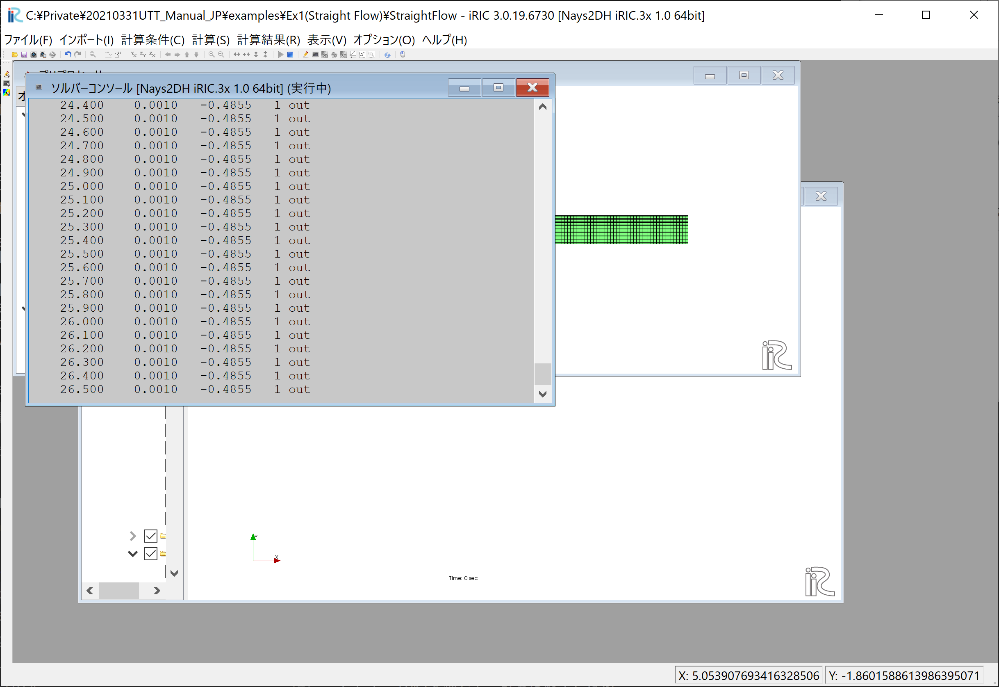

   :Window when the solver is running

From the main menu, when you select [Simulation]->[Run], 
you will get the message like
"We recommend you to save the project before running solver.  Do you want to save?" 
Select [Yes] and save the project with an appropriate name.  At this time,  
do not save the project as an ipro file, but save it as a project. 
A window as :numref:`01_jikko` is shown during the computation, and :numref:`01_keisan` 
appears when the computation is finished.  Then press [OK], and the computation is completed.

.. _01_keisan:

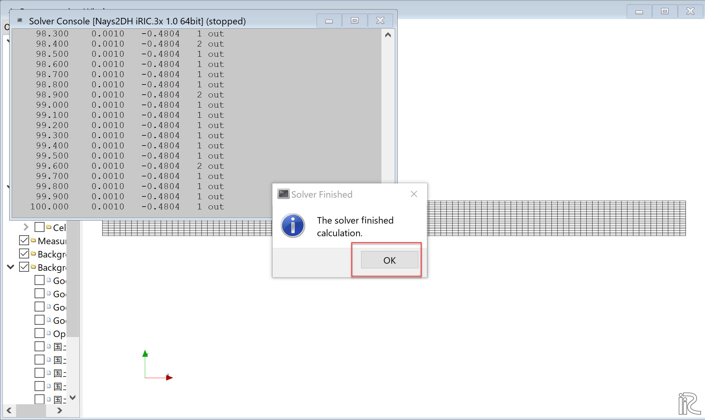

   :Computation completed

**Important**
Whenever you finished the computation,  select [File]->[Save] from the menu bar to save the results
as  :numref:`01_hozon` .
This result is important for later analysis by UTT.

.. _01_hozon:

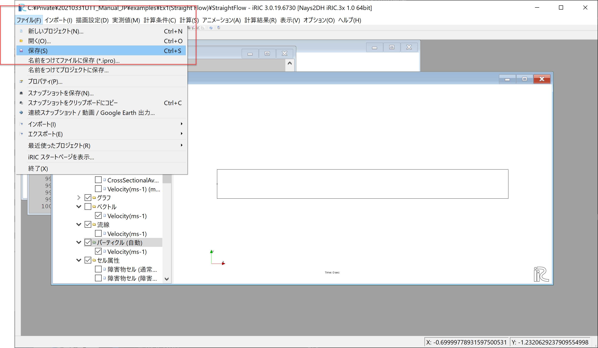

   :Saving computational results

Visualization of the calculated results
----------------------------------------------

After the calculation, 
select [Calculation Result] -> [Open New 2D Post-processing Window] to open the visualization window.

.. _01_kekka_0:

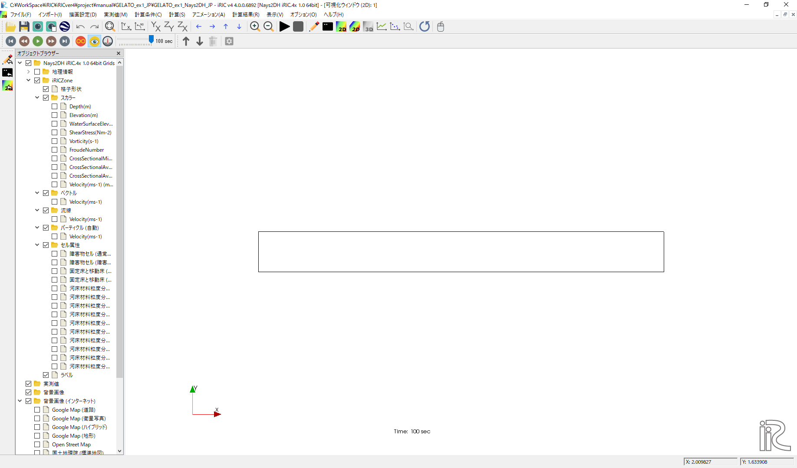

   : 2D Post-processing Window
 

Velocity Vectors
^^^^^^^^^^^^^^^^^^^^

In the [Object Browser], put check marks in the boxes by [Arrow] and [Velocity], click Focus on [Arrow] 
and click the right mouse button [Properties]. Vector setting" window as :numref:`01_kekka_2` appears. 
Set the values in the red line and click [OK].  
:numref:`01_kekka_6` is the depth-averaged velocity vector. Here, the velocity 
distribution is uniform under the constant flow condition.

.. _01_kekka_2:

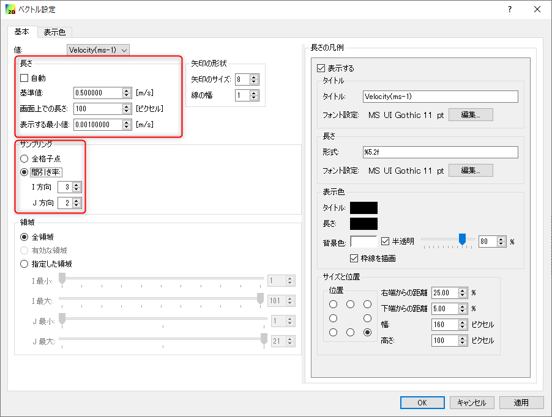

   : Vector Settings
 
.. _01_kekka_6:

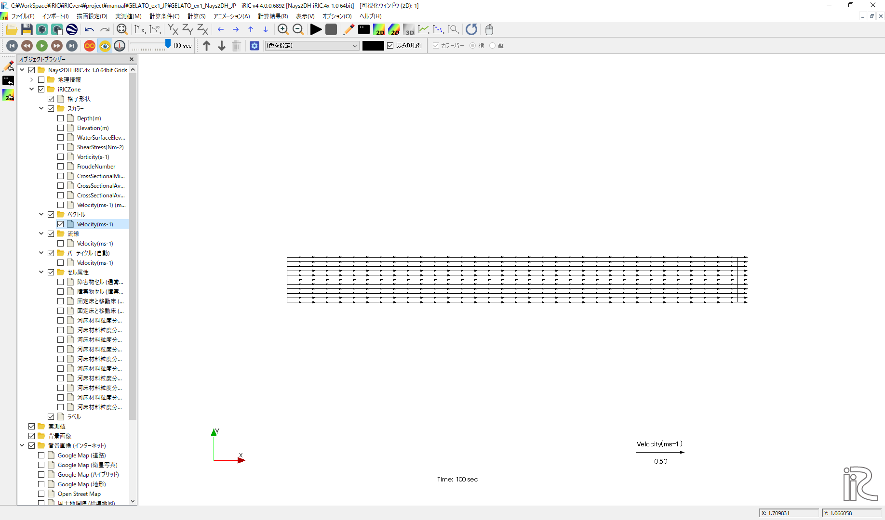

   : Depth averaged velocity vectors
 

Display Particle Movement
^^^^^^^^^^^^^^^^^^^^^^^^^^^^

Uncheck "Vectors" in the Object Browser, and put check marks in "Particles" and "Velocity"
( :numref:`01_kekka_9` )

.. _01_kekka_9:

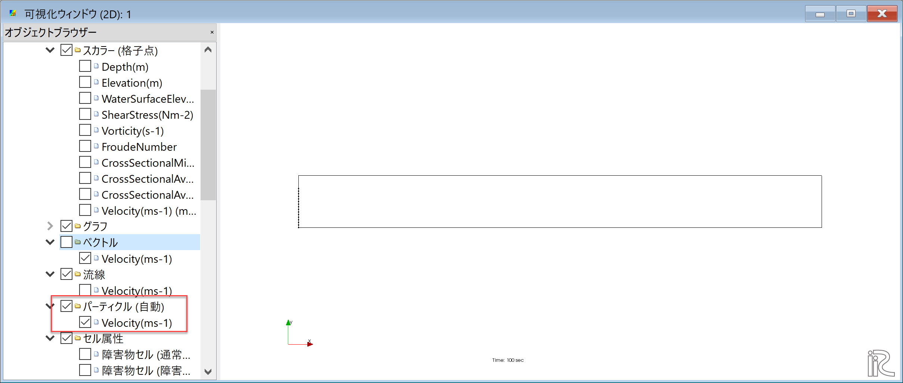

   : Particles(1)
 
Right click [Particle] and select [Properties] as 
:numref:`01_kekka_10` .

.. _01_kekka_10:

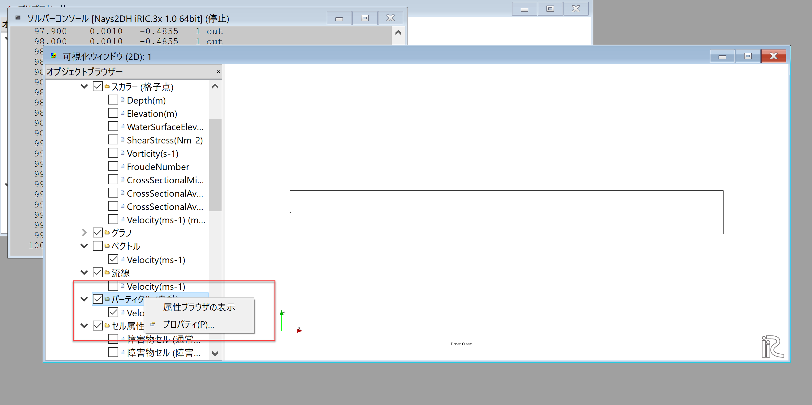

   : Particles(2)
 
Set parameters for particle injection as shown in red box in :numref:`01_kekka_11` .

.. _01_kekka_11:

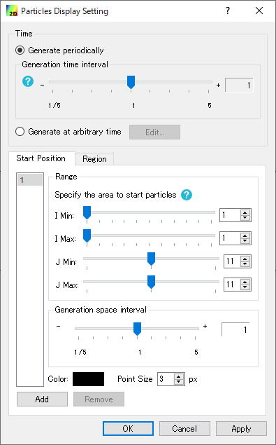

   : Set particle parameters
 
As shown in :numref:`01_kekka_12` , set time bar back to zero, and 
select [Animation]->[Start/Stop Animation] rom the main menu bar.
Then the particle animation starts.

.. _01_kekka_12:

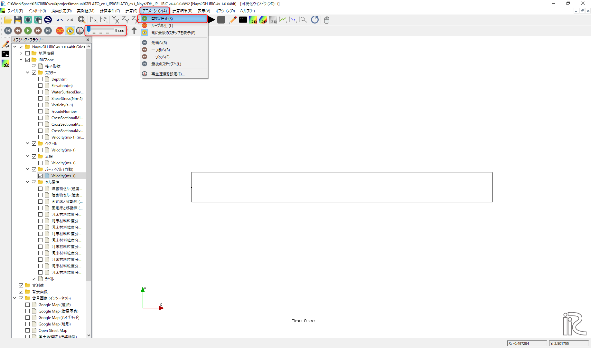

   : Start Particle Animation

.. _01_kekka_13:

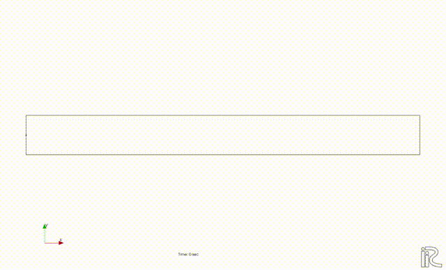

   : Particle animation by NAys2DH

As can be seen in :numref:`01_kekka_13`, since the  
sub-grid scale turbulence is not included in the output velocity from the solver.
It only shows very simple steady and uniform movement.

Tracer Tracking by UTT
========================

Starting UTT
----------------

From the iRIC startup screen, select [New Project], and in the solver selection screen appears. 
Select "UTT" and click "OK" ( :numref:`01_utt_kido` ).

.. _01_utt_kido:

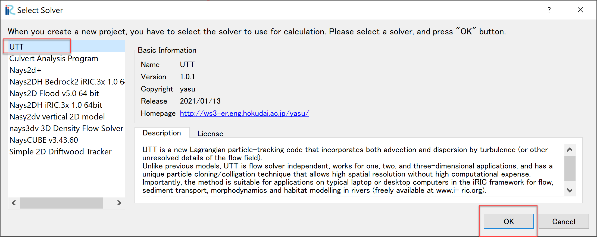

   : Selecting UTT and Starting

A window with [Untitled -iRIC 3.0.xxxx] [UTT] appears, and the UTT session is started.
(:numref:`01_utt_openning` )

.. _01_utt_openning:

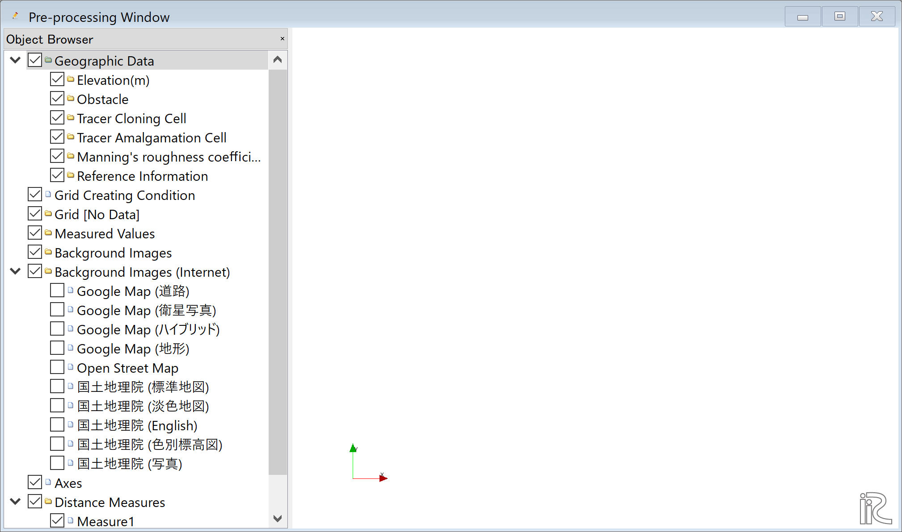

   : Opening UTT 

At this stage, the [Grid] in the [Object Browser] 
shows [No data] as shown in :numref:`01_utt_openning` , 
we will first import the grid data created in :ref:`01_lavel_koshi` session.

.. _01_utt_import:

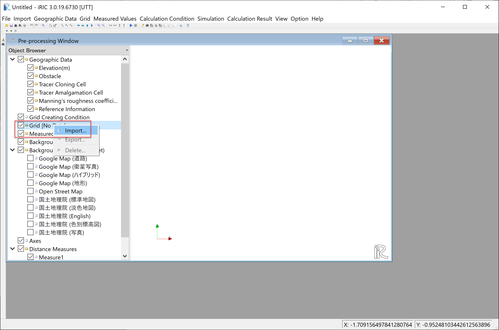

   : Grid data import

Right click [Grid(No Data)] and select [Import] as (:numref:`01_utt_import` ).

.. _01_utt_koshi_1:

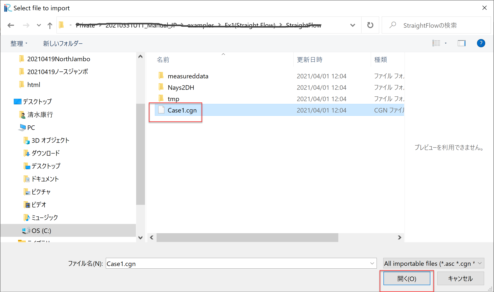

   : Select CGNS file contains grid data

As shown in :numref:`01_utt_koshi_1`, select [Case1.cgn] which contains the grid data
used in the previous section of [Computational Results of NAys2DH], and click [Open].

.. _01_utt_wng:

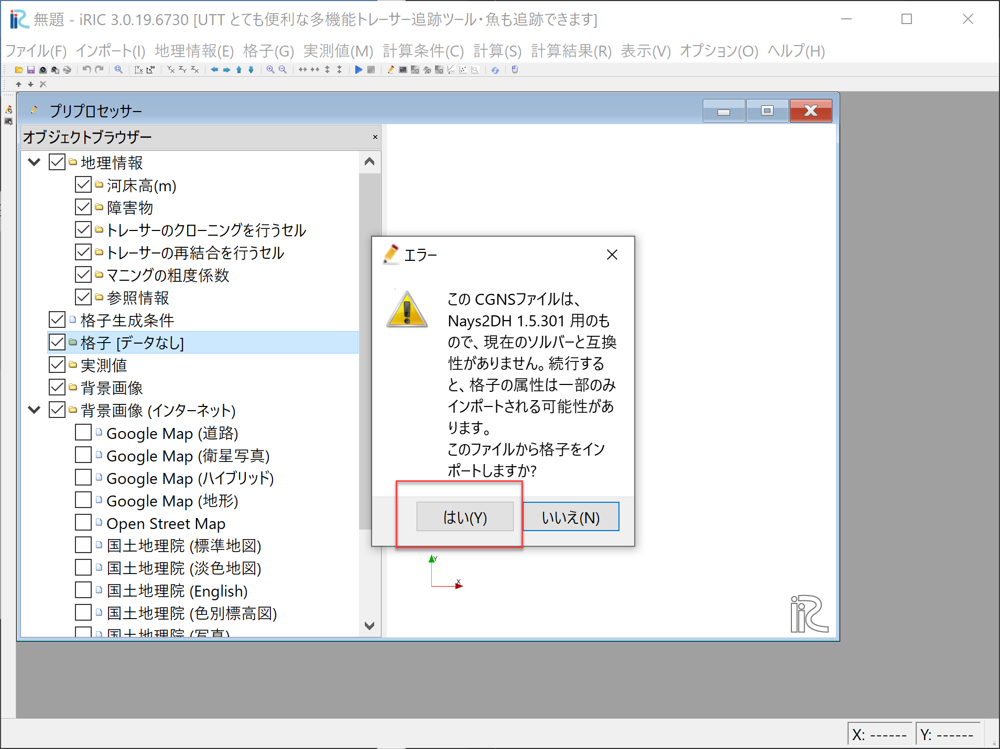

   : Warning Message

A warning message is coming out as :numref:`01_utt_wng` ,
Just click [Yes] without worry, and the grid import is completed as
:numref:`01_utt_grid` .

.. _01_utt_grid:

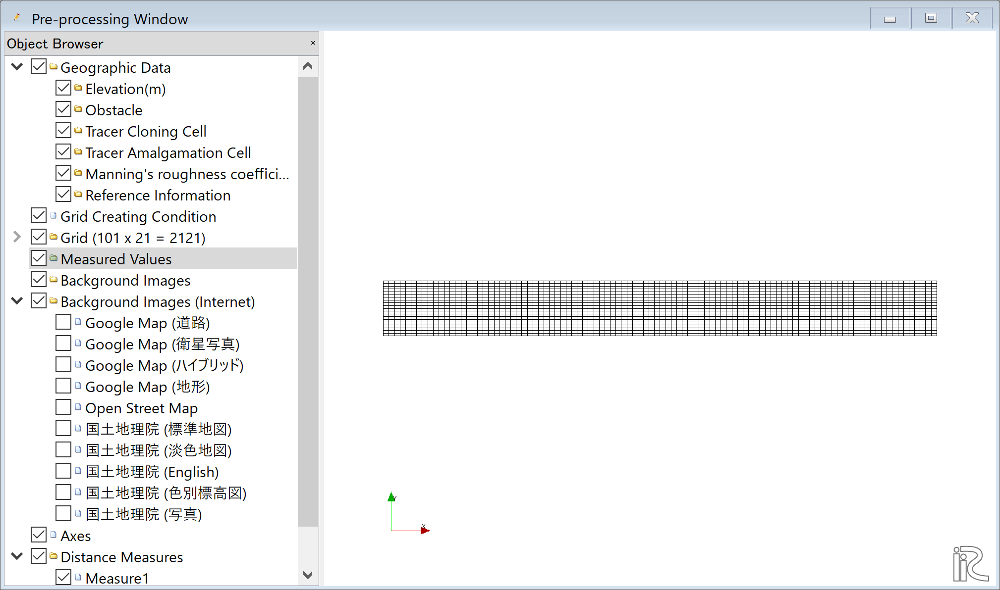

   : Grid import completed

Single Tracer Tracking(Without Turbulent Diffusivity)
--------------------------------------------------------

Condition Settings
^^^^^^^^^^^^^^^^^^^^^

Choose [Calculation Condition]->[Setting] as :numref:`01_joken_0` 

.. _01_joken_0:

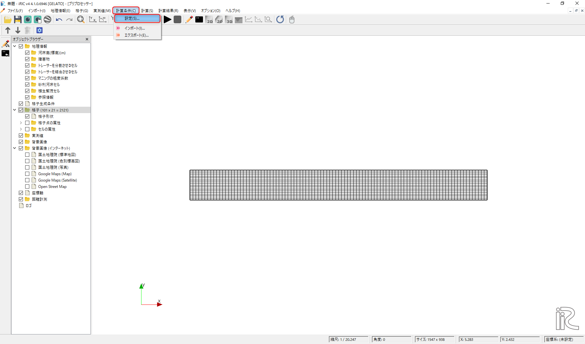

   : Calculation Condition Settings(0)

As shown in :numref:`01_utt_joken_1` set filename at [Basic Settings]->
[Flow information file name] as the CGNS file to read the calculation 
result of the flow field. Here, the CGNS file produced by the Nays2DH computation.
( :ref:`res_Nays2DH` ).

.. _01_utt_joken_1:

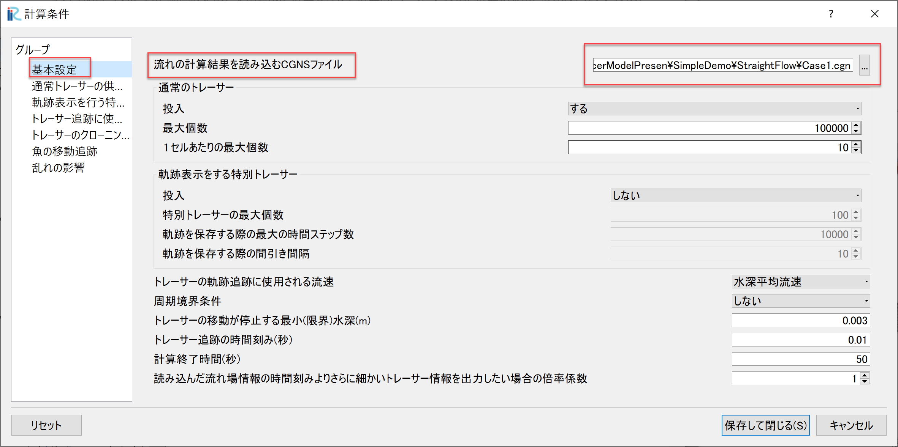

   : Calculation Condition Settings(1)

The rest of the [Basic Settings] are set as :numref:`01_utt_joken_2` . 
Note that the tracers used are only [Normal Tracers].
The tracers used here are [Normal Tracers] only, but no [Special Tracers] are used.

.. _01_utt_joken_2:

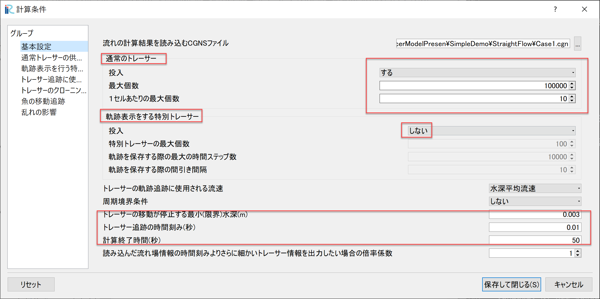

   : Calculation Condition Settings(2)

[Normal Tracers Supplying Conditions]are set, using the parameters described in :ref:`01_lavel_kijutsu`,
as :numref:`01_utt_joken_3`.

.. _01_utt_joken_3:

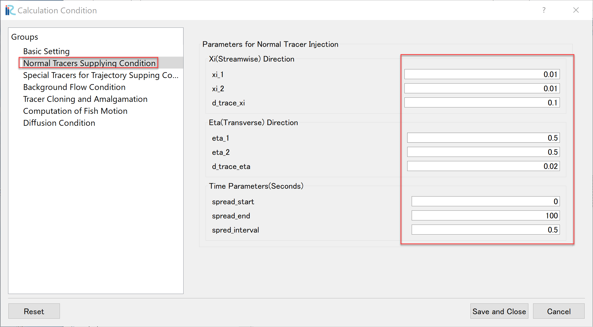

   : Calculation Condition Settings(3)

Set [Diffusion Condition]->[Diffusivity Correction]->[No], and click [Save and CLose]

.. _01_utt_joken_4:

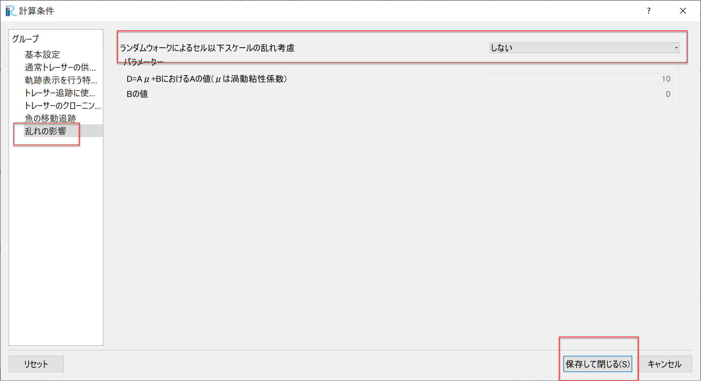

   : Calculation Condition Settings(4)

Launch UTT
^^^^^^^^^^^^

From the main menu bar, select [Simulation]->[Run], then you are asked 
[Do you want to save?] as :numref:`01_utt_jikko_0`.
When you click [Yes] and save project, the computation starts as 
:numref:`01_utt_jikko_1`.

.. _01_utt_jikko_0:

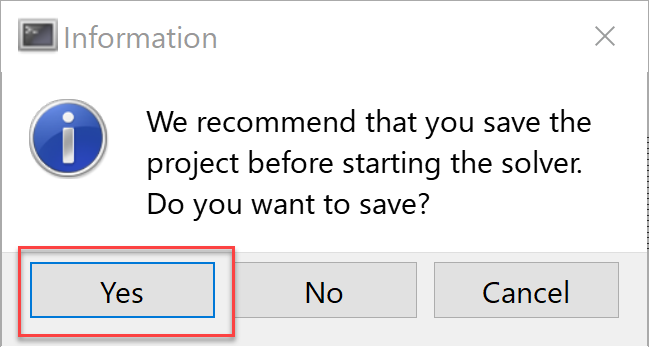

   : Do you want to save?

.. _01_utt_jikko_1:

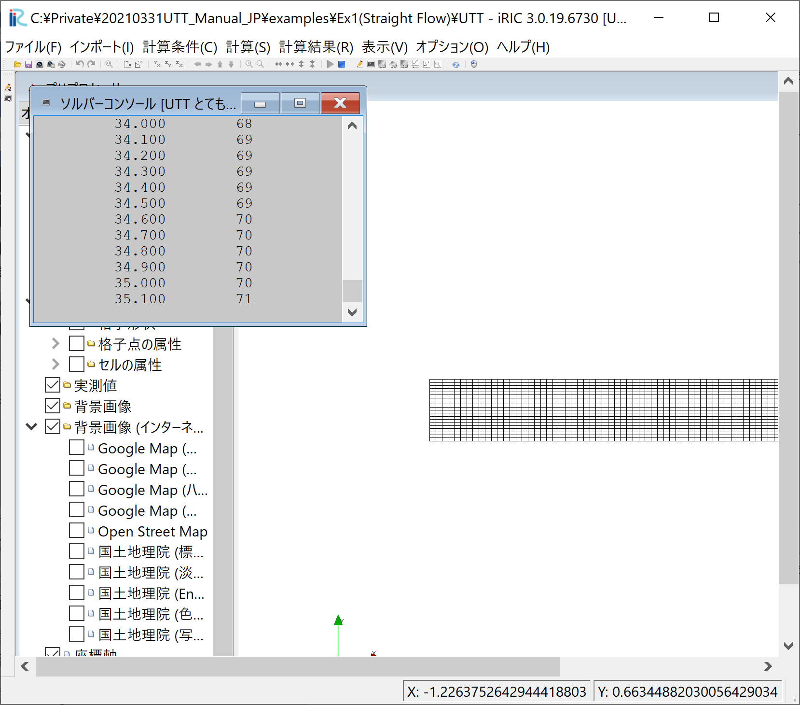

   : Launch UTT

When the computation finishes, :numref:`01_utt_jikko_2` appears, and 
click [OK] for confirmation.

.. _01_utt_jikko_2:

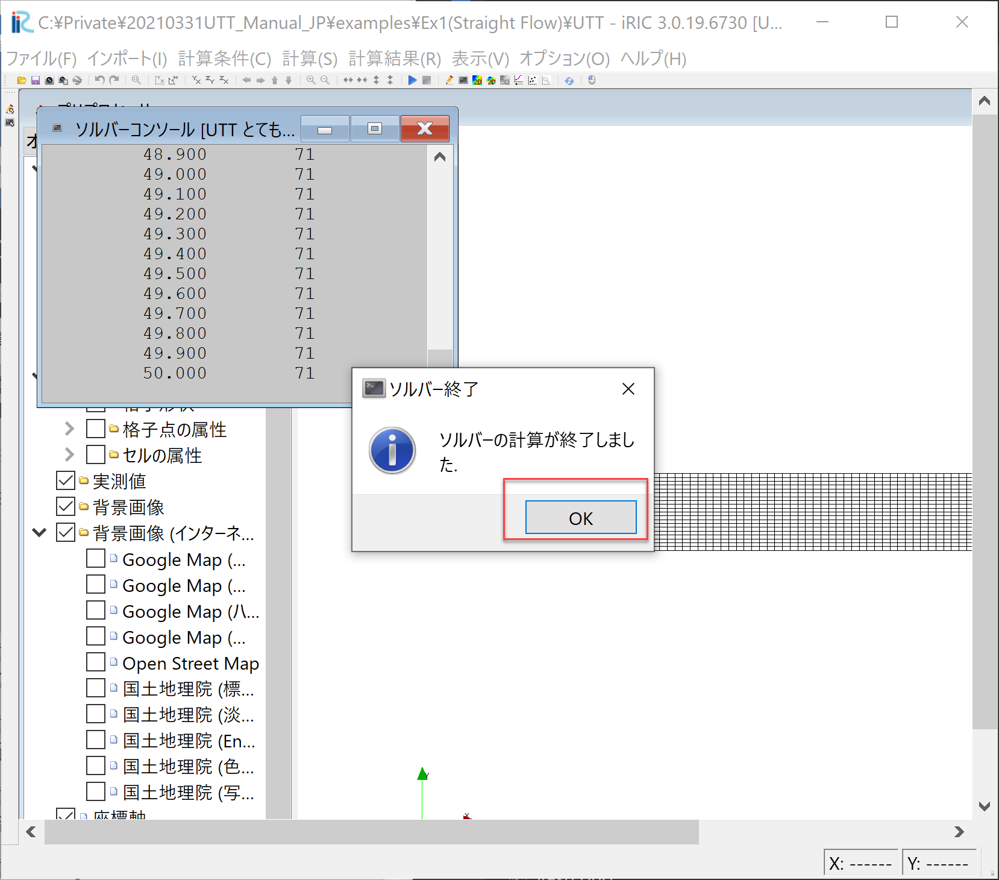

   : Computation finished 

Visualization of Computational Results
^^^^^^^^^^^^^^^^^^^^^^^^^^^^^^^^^^^^^^^^^^^

From the main menu, select [Calculation Result]->[Open ne 2D Post-processing Window],
then [2D Post Processing Window] appears as :numref:`01_utt_kekka_0`.

.. _01_utt_kekka_0:

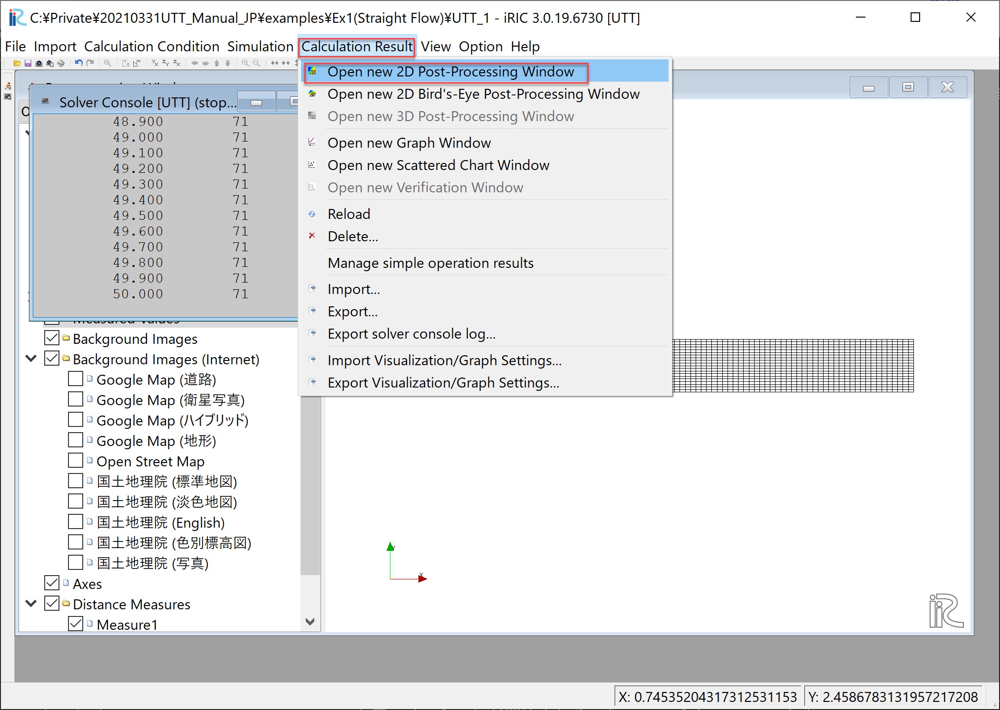

   : 2D Post Processing Window

From the main menu, select [Animation]->[Start/Stop] as :numref:`01_utt_kekka_1`,
animation starts ( :numref:`01_utt_00` ).

.. _01_utt_kekka_1:

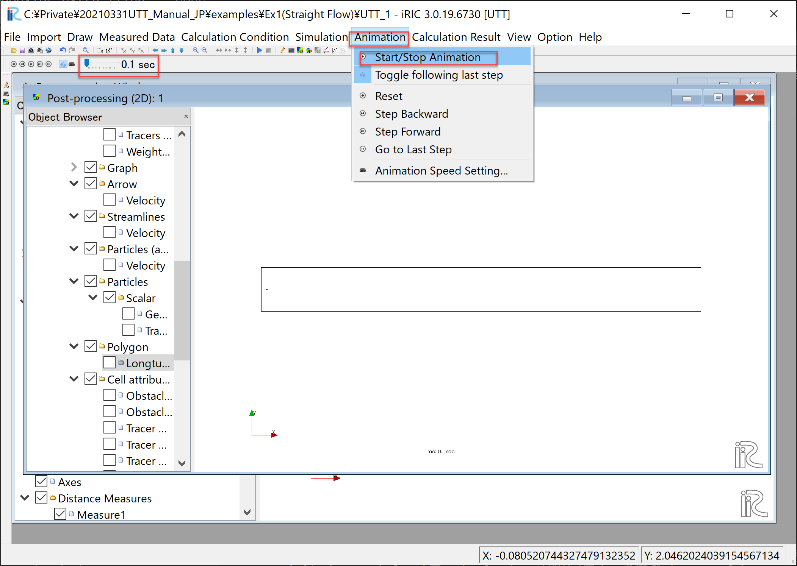

   : Visualization of computational results

.. _01_utt_00:

   : Tracer movement(No diffusivity)

It is obviously very simple because it  doesn't including any turbulent effect 
(:numref:`01_utt_00`).

Single Tracer Tracking(With Turbulent Diffusivity)
-----------------------------------------------------

Setting Computational Condition
^^^^^^^^^^^^^^^^^^^^^^^^^^^^^^^^^^^^

Change the calculation conditions to take into account for the effect of turbulent diffusion. 
From the main menu, select [Calculation Conditions] → [Setting], and show the :numref:`01_utt_joken_5`.
Set [Diffusion Condition]->[Diffusivity Correction]->[Yes], 
set the parameter [A Value] to [1], and then click "Save and Close".

.. _01_utt_joken_5:

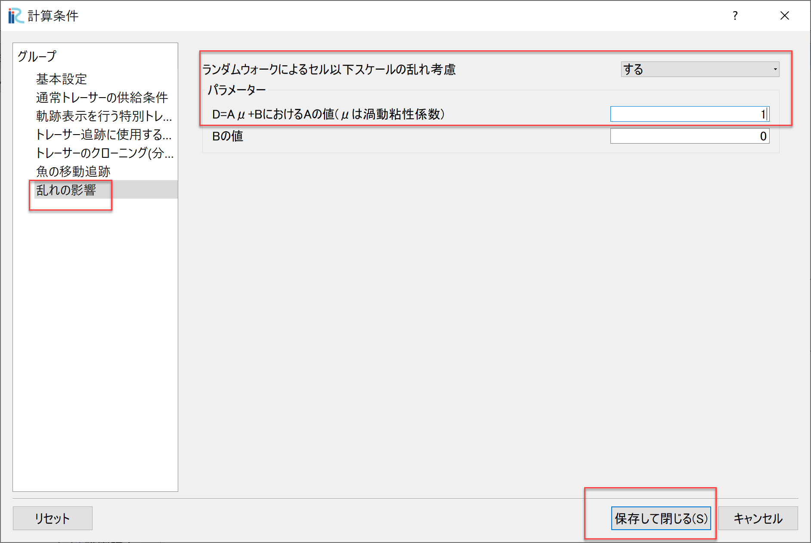

   : Calculation Condition (Diffusion Condition)

Launch UTT and the Results Visualization
^^^^^^^^^^^^^^^^^^^^^^^^^^^^^^^^^^^^^^^^^^^^

Computation can be conducted through the same procedure as previous example, 
the animation becomes as :numref:`01_utt_01`.

.. _01_utt_01:

   : Tracer Movement(With Turbulent Diffusivity A=1)

When the value of A is set as [10], the results become as 
:numref:`01_utt_10`, the effect of the turbulent becomes stronger.

.. _01_utt_10:

   : Tracer Movement(With Turbulent Diffusivity A=10)
