==============================================
[計算例 1] 直線水路におけるトレーサーの輸送
==============================================

Nays2DHによる流れの計算
=========================

ソルバの選択
---------------

iRICの起動画面から、[新しいプロジェクト]を選ぶと表示されるソルバの選択画面で、
[Nays2DH]を選んで[OK]ボタン押すと、

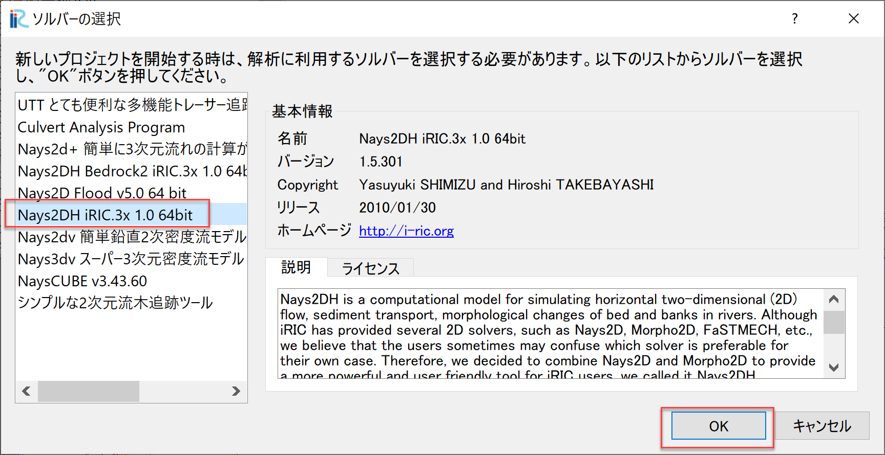

   : ソルバーの選択

「無題- iRIC 4.x.x.xxxx [Nays2DH iRIC4X 1.0 64bit]」と書かれた
Windowが現れる。

.. _01_mudai:

.. figure:: images/01/mudai.png 
   :width: 100%

   : 無題

計算格子の作成
----------------

:numref:`01_mudai` 
のウィンドウで、[格子]→[格子生成アルゴリズムの選択]から現れる、
「格子生成アルゴリズムの選択」ウィンドウ で[簡易直線・蛇行生成ツール]を選んで[OK]を押す。

.. _01_kanni:

.. figure:: images/01/kanni.png
  :width: 600pt

  : 格子生成アルゴリズムの選択

:numref:`01_koushi_1` の画面で、「水路形状」を選択し、
「水路主要部の形状」を[直線水路]、「X方向長さもしくは流下方向延長(m)」を[5],
「X方向の格子数」を[100]、「Y方向長さもしくは水路幅(m)」を[0.5]、
「Y方向または横断方向格子数」を[20]、
「主要部の河床勾配」を[0.005],「下流端の河床高(m)」を[-0.5]に
設定し、他はすべてデフォルトなので、「格子生成」をクリックする。

.. _01_koushi_1:

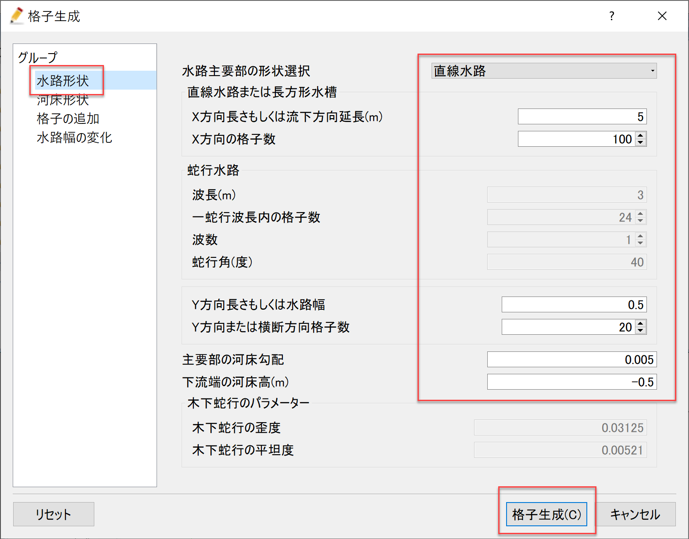

   :水路形状

すると、:numref:`01_koushi_3` 確認ウィンドウが現れるので,[はい(Y)]を押すと格子が生成され、
:numref:`01_koushi_4` が表示される。

.. _01_koushi_3:

.. figure:: images/01/koushi_3.png
   :width: 400pt

   :確認(マッピング)

.. _01_koushi_4:

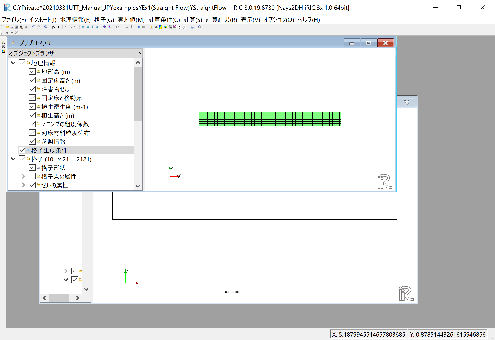

   :格子生成完了

Nays2dHによる流れの計算条件の設定
---------------------------------

次に計算条件の設定を行う。メニューバーから「計算条件」→「設定」を選ぶと、
計算条件設定ウィンドウ :numref:`01_joken_1` が表示される。

.. _01_joken_1:

   :計算条件

:numref:`01_joken_2` の「境界条件」の「上流端流量と下流端水位の時間変化」で[Edit]を
クックして、流量ハイドログラフ入力ウィンドウ :numref:`01_joken_3` に
移る。

.. _01_joken_2:

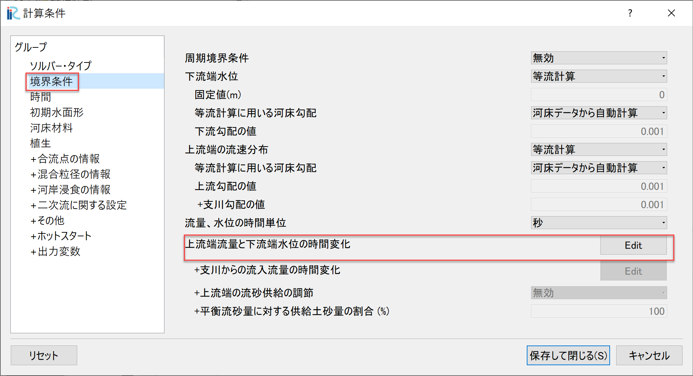

   :流量設定

.. _01_joken_3:

.. figure:: images/01/joken_3.png
   :width: 600pt

   :流量下流端水位設定ウィンドウ

:numref:`01_joken_3` において、「時間」「流量」のハイドログラフを入力する。
ここでは、0～100秒まで、0.001㎥/sの一定流量を与える。設定が終わったら[OK]を押して
ウィンドウを閉じる。

.. _01_joken_4:

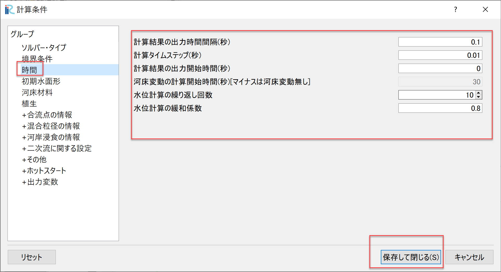

   :時間に関するパラメータ

「時間」を選択し、パラメーターは :numref:`01_joken_4` のように設定し、
「OK」をクリックする。

Nays2dHによる流れの計算実行
----------------------------------

.. _01_jikko:

   :計算実行中の画面

[計算]→[実行]を指定すると、「計算開始する前に、プロジェクトを保存しますか?」
など聞かれるので、「はい(Y)」を選択しプロジェクトを適当な名前で保存する。
この時。プロジェクトはiproファイルで保存せずに必ずフォルダで保存すること。
計算中は :numref:`01_jikko` のような画面が表示され、計算が修了すると、
終了すると、:numref:`01_keisan` のような画面が現れるので、
[OK]を押して、計算は終了となる。

.. _01_keisan:

.. figure:: images/01/keisan.png
   :width: 250pt

   :計算の終了

**重要** 
計算が終わったら必ず :numref:`01_hozon` のメニューバーの「ファイル」「保存」を
選んで計算結果を保存すること。この結果は後に行うGELATOによる解析で重要となる。

.. _01_hozon:

   :計算結果の保存

計算結果の表示
-------------------------

計算の終了後、[計算結果]→[新しい可視化ウィンドウ(2D)を開く]を選ぶことによって、可視化ウィンドウが現れる。

.. _01_kekka_0:

.. figure:: images/01/kekka_0.png
   :width: 100%

   : 計算結果の表示
 

流速ベクトルの表示
^^^^^^^^^^^^^^^^^^^

オブジェクトブラウザーで、[ベクトル][Velocity]に☑マーク入れて、
[ベクトル]をフォーカスさせてマウス右ボタン[プロパティ]をクリックすると、
「ベクトル設定」ウィンドウ :numref:`01_kekka_2` が現れる。ここで、赤線で
囲った部分の設定をして[OK]を
押すと :numref:`01_kekka_6` が表示される。:numref:`01_kekka_6` は水深平均流速ベクトル
である。等流状態で一様の流速分布となっている。 

.. _01_kekka_2:

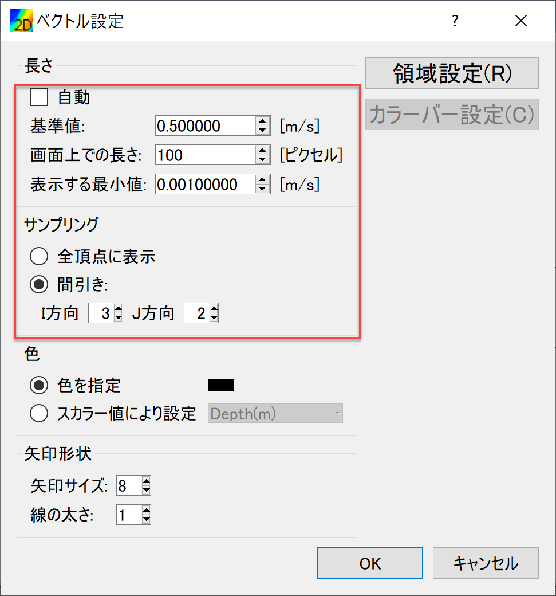

   : ベクトル設定
 
.. _01_kekka_6:

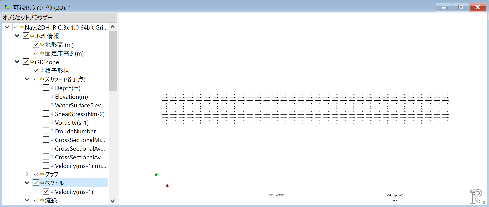

   : 水深平均流速ベクトル表示
 

パーティクルの表示
^^^^^^^^^^^^^^^^^^^

オブジェクトブラウザーの「ベクトル」を一旦アンチェックし、「パーティクル」と「Velocity」
に☑マークを入れる。( :numref:`01_kekka_9` )

.. _01_kekka_9:

   : パーティクル(1)
 
:numref:`01_kekka_10` のように「パーティクル」右クリックして「プロパティ」を選ぶと、

.. _01_kekka_10:

.. figure:: images/01/kekka_10.png
   :width: 100%

   : パーティクル(2)
 
:numref:`01_kekka_11` のような「パーティクルの設定」画面が現れるので、図の赤囲いのように
パーティクスの発生位置を指定する。

.. _01_kekka_11:

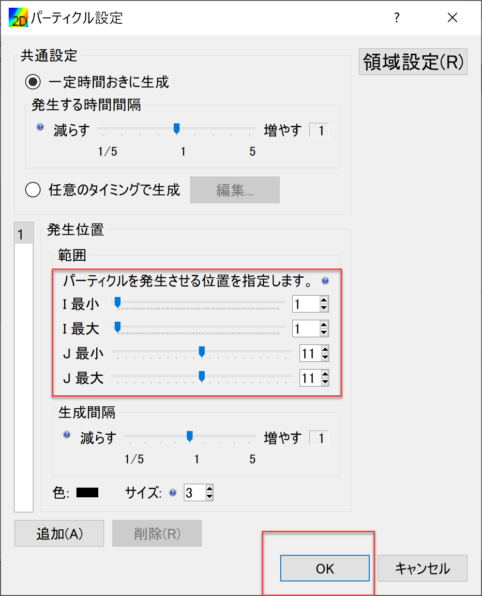

   : パーティクルの設定
 
.. _01_kekka_12:

:numref:`01_kekka_11` に示すように、タームバーをゼロに戻し、メインメニューから、
「アニメーション」「開始/停止」を選ぶことにより、 :numref:`01_kekka_13` 
のようなパーティクルの動きが表示される。 

.. figure:: images/01/kekka_12.png
   :width: 100%

   : アニメーションの再生

.. _01_kekka_13:

   : Nays2dhによるパーティクルアニメーション

:numref:`01_kekka_13` からわかるよに、流れの計算結果をそのままパーティクル表示すると、
乱流による乱れ成分が含まれていないので、**何の変哲も無い** 単純で退屈な
表示しかされない( ^^) _U~~

GELATOよるトレーサーの追跡
===============================

GELATOの起動
----------------

iRICの起動画面から、[新しいプロジェクト]を選ぶと表示されるソルバの選択画面で、
「GELATOとても便利な多機能トレーサー追跡ツール・魚も追跡できます」を選んで、「OK」を
クリックする。( :numref:`01_GELATO_kido` )

.. _01_GELATO_kido:

.. figure:: images/01/GELATO_kido.png
   :width: 600pt

   : GELATOの選択と起動

「無題 -iRIC 4.x.x.xxxxx [GELATO(旧 UTT)]」
と書かれたウインドウが現れ、GELATOセッションが開始される。(:numref:`01_GELATO_openning` )

.. _01_GELATO_openning:

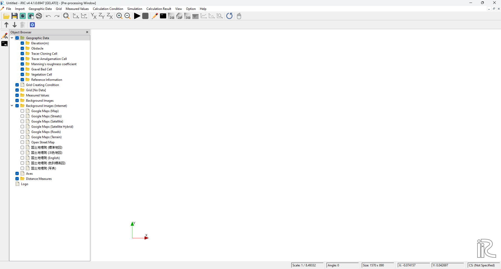

   : GELATOの起動
  
この状態の「プリプロセッサー」の「オブジェクトブラウザー」の「格子」の部分には
[データなし]と表示されている( :numref:`01_GELATO_openning` ) ので、まずは前記 
(:numref:`01_koushi_4`)で作成したものをインポートする。

.. _01_GELATO_import:

.. figure:: images/01/GELATO_import.png
   :width: 100%

   : 格子データのインポート

「格子(データーなし)」を右クリックして「インポート」を選ぶ (:numref:`01_GELATO_import` ).

.. _01_GELATO_koshi_1:

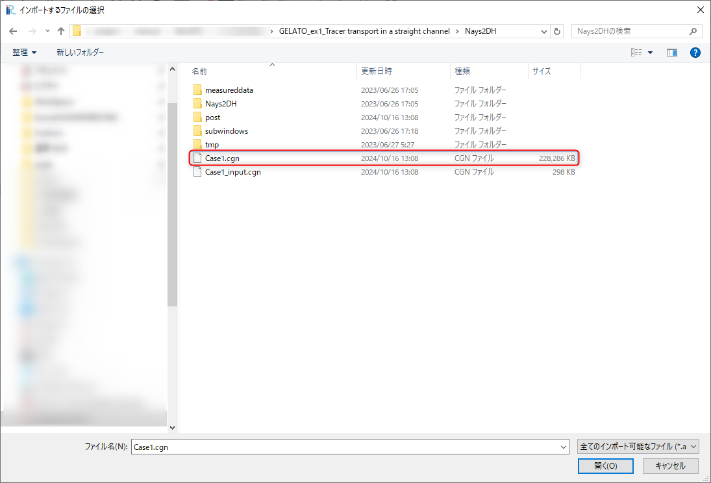

   : 格子データファイルの選択

:numref:`01_GELATO_koshi_1` に示すように前述の「Nays2DHによる計算結果」を
セーブしたプロジェクトフォルダーの中にある
「Case1.cgn」を選択して、「開く」をクリックする。

.. _01_GELATO_wng:

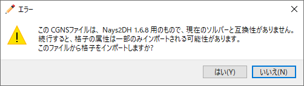

   : 警告

:numref:`01_GELATO_wng` 「このCGNSファイルは・・・ナンチャラ・・・・インポートしますか？」
と出るが、細かいことは気にせずに「はい(Y)」と答えると、
:numref:`01_GELATO_grid` のように格子のインポートが完了する。

.. _01_GELATO_grid:

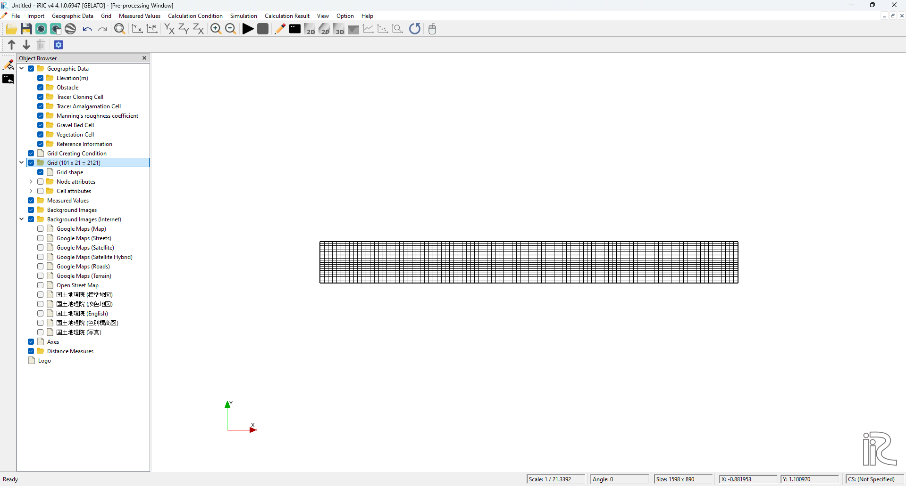

   : 格子のインポート完了

2個のトレーサーの追跡(乱流拡散無し)
-------------------------------------

計算条件の設定
^^^^^^^^^^^^^^^^^

:numref:`01_joken_0` に示すように、メインメニューから「計算条件」「設定」を選ぶ。

.. _01_joken_0:

.. figure:: images/01/joken_0.png
   :width: 100%

   : 計算条件の設定(0)

以下に示すように計算条件を設定していく。

「基本設定」の「流れの計算結果を読み込むCGNSファイル」には前記の「Nays2DHの計算結果」
が格納されているCGNSファイルを指定する。

.. _01_GELATO_joken_1:

   : 基本設定

.. _01_GELATO_joken_2:

.. figure:: images/01/GELATO_joken_2.png
   :width: 600pt

   : プライマリートレーサーの供給条件

.. _01_GELATO_joken_3:

   : セカンダリートレーサーの供給条件

.. _01_GELATO_joken_4:

.. figure:: images/01/GELATO_joken_4.png
   :width: 600pt

   : 通常トレーサーの時間設定

.. _01_GELATO_joken_5:

.. figure:: images/01/GELATO_joken_5.png
   :width: 600pt

   : 乱れの影響

他の条件はデフォルトの値を使用する。

計算の実行
^^^^^^^^^^^^

メインメニューから、「計算」「実行」を選ぶと、「保存しますか？」
のようなメッセージが出るので、「はい(Y)」を選んで、プロジェクトを保存する。
保存が終了すると、計算が実行され、:numref:`01_GELATO_jikko_1` のようなウィンドウが
表示される。

.. _01_GELATO_jikko_1:

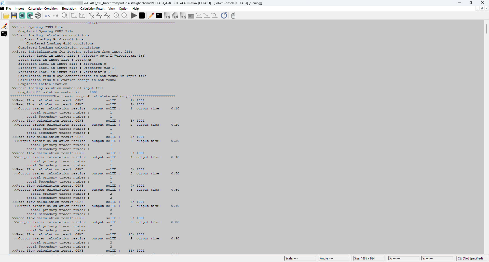

   : 計算の実行

計算が終了すると、:numref:`01_GELATO_jikko_2` のようなウィンドウが
表示されるので「OK」を押す。

.. _01_GELATO_jikko_2:

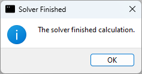

   : 計算の実行  

計算結果の表示
^^^^^^^^^^^^^^^

メインメニューから、「アニメーション」「開始/停止」を選ぶ（ :numref:`01_GELATO_kekka_1` )
とアニメーションが開始される。( :numref:`01_GELATO_00` )
トレーサーはプライマリーとセカンダリーそれぞれのプロパティから色を設定することができる。

.. _01_GELATO_kekka_1:

   : 計算結果の表示  

.. _01_GELATO_00:

.. figure:: images/01/GELATO_00.gif
   :width: 70%

   : トレーサーの動き(拡散無し)

当然、乱流拡散なしの場合は :numref:`01_GELATO_00` のような単純な結果となる。

2個のトレーサーの追跡(乱流拡散有り)
-------------------------------------

計算条件の設定
^^^^^^^^^^^^^^^^^

計算条件を変更し、乱流拡散の影響を考慮する。メインメニューから「計算条件」→「設定」を選択し、
:numref:`01_GELATO_joken_6` の「計算条件」の設定ウィンドウを表示し、
「乱れの影響」の「ランダムウォークによるセル以下スケールの乱れの考慮」を「する」に設定し、
パラメーターの「Aの値」を[1]に設定し、「OK」を押す。

.. _01_GELATO_joken_6:

.. figure:: images/01/GELATO_joken_6.png
   :width: 600pt

   : 乱れの影響

計算の実行と結果の表示
^^^^^^^^^^^^^^^^^^^^^^^^

前記と同様に計算を実行して結果をアニメーション表示すると、:numref:`01_GELATO_01` のような
結果となる。

.. _01_GELATO_01:

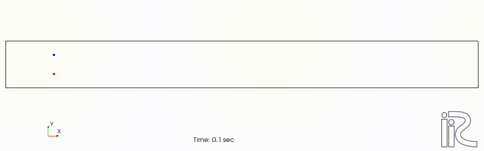

   : トレーサーの動き(拡散あり A=1)

さらに Aの値を10とすると、:numref:`01_GELATO_10` となり、明らかに乱れの影響が大きくなる。

.. _01_GELATO_10:

.. figure:: images/01/GELATO_10.gif
   :width: 70%

   : トレーサーの動き(拡散あり A=10)
