==================================================================
[Example 2] Suspended Material Transport in a Simple Bed Flume
==================================================================

In this section, we perform the following computations using a simple curved flume with straight inlet
out let parts.  The Cross section of the flume is composed with a compound channel in which both the low water 
channel and the flood plane with moveable bed.  Then flood plane is located only left side of the low water channel.
The experiment was carried out by `CTI Engineering Co. Ltd. <http://www.ctie.co.jp/english/>`_ on behalf of 
`Civil Engineering Research Institute of Cold Region <https://www.ceri.go.jp/english/index.html>`_ . 
A movie taken from a drone during the experiment is shown in :numref:`02_jikken`, and the
experimental condition and plane and cross sectional view pictures are shown in :numref:`02_heimen`. 

.. _02_jikken:

.. figure:: images/02/jikken.gif
   :align: center
   :width: 400pt

   : Experimental Video

.. _02_heimen:

.. figure:: images/02/heimen.png
   :align: center
   :width: 450pt

   : Flume Shape

The computational exercises in this section is conducted as the following procedure.

- Flow and bed deformation by Nays2DH until the bed reaches an equilibrium state
- Quasi 3-dimensional flow field by Nays2d+
- Tracer tracking by GELATO. Check the effect of turbulent diffusivity by changing parameter

Calculation of Flow and bed deformation by Nasy2DH
========================================================

Select a Solver
-------------------

From the iRIC startup screen, click [Create New Project], and select 
[Nays2dH iRIC3x 1.0 64bit] in the :numref:`02_Select_Nays2dh`.

.. _02_Select_Nays2dh:

.. figure:: images/01/Select_Nays2dh.png
   :align: center
   :width: 600pt

   : Solver Selection

A window titled as「Untitled- iRIC 3.x.xxxx [Nays2DH iRIC4X 1.0 64bit]」appears.

.. _02_mudai:

.. figure:: images/01/mudai.png 
   :align: center
   :width: 100%

   : Launch Nays2DH

Grid Creation 
----------------

Select from the main menu [Grid]->[Select Algorithm]. Then a window appears as
:numref:`02_koshi1`, select [2d arc grid generator (Compound Channel)] and click
[OK].

.. _02_koshi1:

.. figure:: images/02/koshi1.png 
   :align: center
   :width: 600pt

   : Select Algorithm to Create Computational Grid

In the [Groups] of the [Grid Creation] window, set parameters of,
[Channel shape], [Cross section], [Additional Channel] and [Roughness and 
fixed/moveable bed] as,
:numref:`02_koshi2` , 
:numref:`02_koshi3` ,
:numref:`02_koshi4` , and 
:numref:`02_koshi5` , respectively.

.. _02_koshi2:

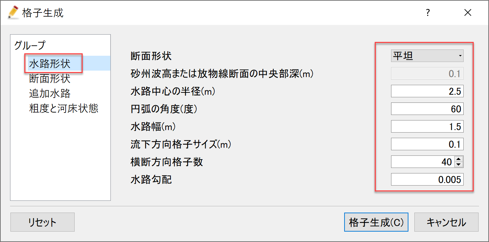

   : Grid Creating Condition(1)

.. _02_koshi3:

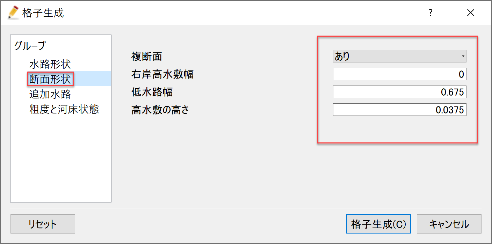

   : Grid Creating Condition(2)  

.. _02_koshi4:

.. figure:: images/02/koshi4.png 
   :align: center
   :width: 600pt

   : Grid Creating Condition(3)

.. _02_koshi5:

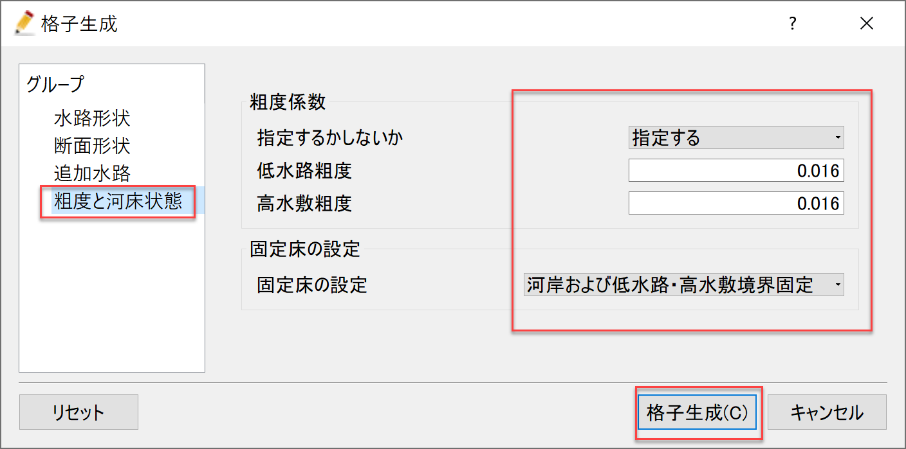

   : Grid creating Condition(4)

When you finished all the settings of the grid creating condition, click [Create Grid] in the above 
grid creating condition windows, e.g. :numref:`02_koshi5`.
After clicking [Create Grid] button, you will be asked [Do you want to map?], then answer [Yes], and 
the computational grid is created.
( :numref:`02_mapping` )

.. _02_mapping:

.. figure:: images/02/mapping.png
   :align: center
   :width: 400pt

   : Confirmation of mapping.

Put check marks in [Grid], [Cell Attributes] and [Fixed or Moveable bed] in the object browser, 
:numref:`02_koshi6` appears with the fixed bed part in red and the moveable bed part shown in blue. 

.. _02_koshi6:

.. figure:: images/02/koshi6.png
   :align: center
   :width: 100%

   : Grid Shape with Fixed and Moveable bed Colored 

The red part of the fixed bed along the boundary between the low water channel and the flood plane is assumed 
to be a revetment, in this grid creating tool, however, since the revetment in the actual experiment is only 
the bend part plus short length of upstream and downstream. 
So, as shown in :numref:`02_koshi7`, focus [Fixed or Moveable bed], and right-click on a straight section of 
the revetment part (in this case, the red section upstream of grid number 101) and change the attribute to 
[Moveable bed], and press [OK].

.. _02_koshi7:

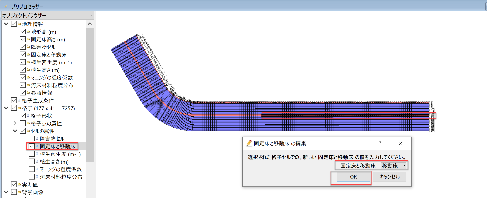

   : Change attribute from fixed bed to moveable bed

Since the downstream end is the fixed bed, set the attribute of the downstream end cells into [Fixed Bed],
by expanding and rotating, as demonstrated in :numref:`02_koshi8`.

.. _02_koshi8:

.. figure:: images/02/koshi8.png
   :align: center
   :width: 100%

   : Change downstream end cell attribute to fixed bed

Setting Computational Condition
------------------------------------

Show the [Calculation Condition] window by selecting [Calculation Condition]->[Setting],
and in the [Group] of [Solver Type], [Boundary Condition], [Time] and [Bed Material]
, set the parameters, as
:numref:`02_joken1` , 
:numref:`02_joken2` ,
:numref:`02_joken3` , and 
:numref:`02_joken4`, respectively.

.. _02_joken1:

.. figure:: images/02/joken1.png
   :align: center
   :width: 600pt

   : Calculation Condition(Solver TYpe)

.. _02_joken2:

.. figure:: images/02/joken2.png
   :align: center
   :width: 600pt

   : Calculation Condition(Boundary Condition)

.. _02_joken3:

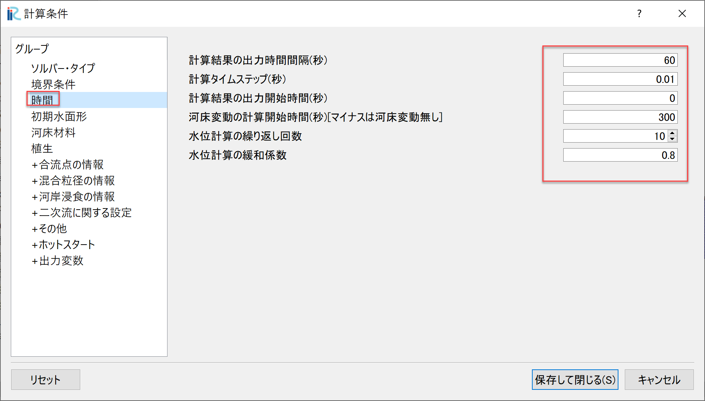

   : Calculation Condition(Tme)

.. _02_joken4:

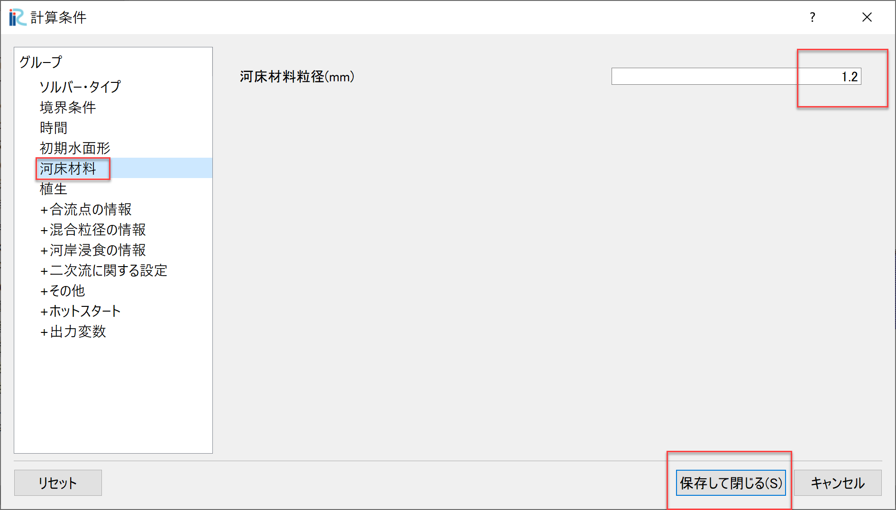

   : Calculation Condition(Bed Material)

In addition, in the [Boundary Condition] setting of :numref:`02_joken2`, 
press [Edit] of [Time series of discharge at upstream end ......],
and set [Time] and [Discharge] hydrograph data in the [Time series of discharge at upstream end ......]
window as :numref:`02_joken5`, and press [OK].

.. _02_joken5:

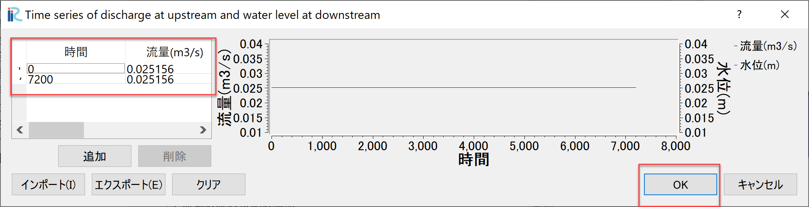

   : Setting Discharge Hydrograph

When you finished the settings of all the computational condition parameters,
press [OK] in the [Calculation Condition] window.

Run Nays2DH
--------------

Before executing the Nays2DH, select [File]->[Save as Project] and save the project. 
Here we save the project as a name of [Nays2DH_flow_bed] (:numref:`02_save_project`)

.. _02_save_project:

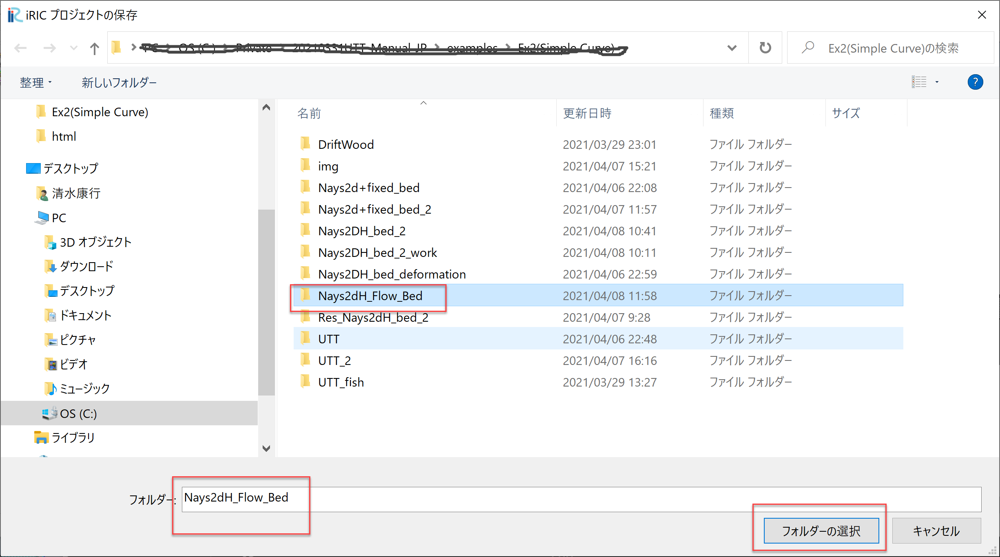

   : Save Project

From the main menu, select [Simulation]->[Run], then a window asking [Do you want to save?] appears
as :numref:`02_jikko1`. Then press [Yes], save as a project, and the computation starts running 
as :numref:`02_jikko2`.

.. _02_jikko1:

.. figure:: images/02/save_project3.png
   :align: center
   :width: 400pt

   : 「Do you want to save?」

.. _02_jikko2:

.. figure:: images/02/jikko2.png
   :align: center
   :width: 100%

   : 「Nays2dH is running」
 
When the computation finished, save the results by selecting [Calculation Result]->[Save], from the main menu.

Display the Calculation Results
----------------------------------

Open a [Post Processing Window] by selecting [Calculation Result]->[Open new 2D Post-Processing Window] as
:numref:`02_hyoji1-0`.   

.. _02_hyoji1-0:

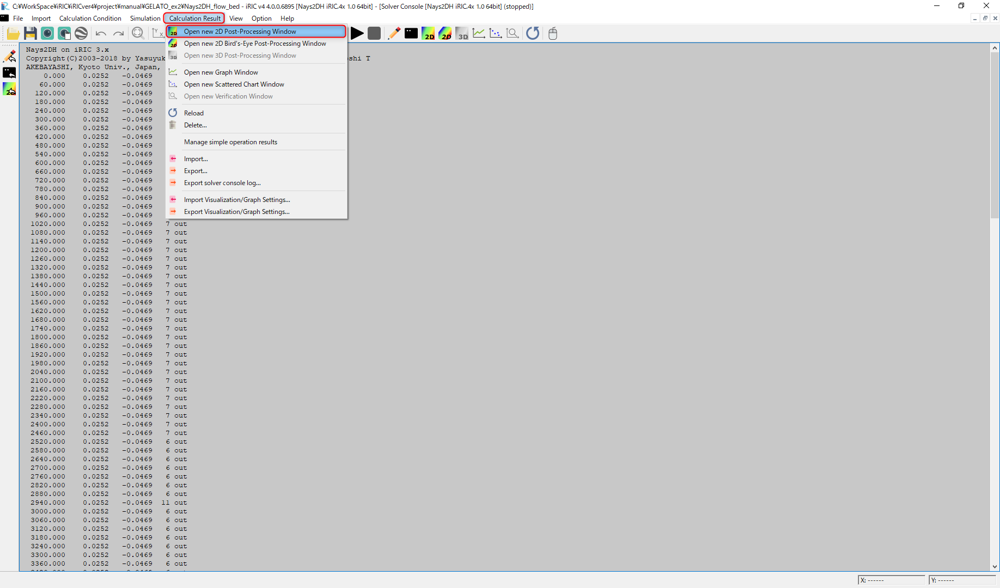

   : Open Post Processing Window

In the object browser of the [Post Processing Window], put check marks in 
[iRICZone], [Scalar(node)] and [ElevationChange(m)], 
right click [ElevationChange(m)] to show [Property] and press it, 
open [Scalar Settings], and set parameters as :numref:`02_hyoji1`.

.. _02_hyoji1:

.. figure:: images/02/hyoji1.png
   :align: center
   :width: 70%

   : 「Scalar Setting」

In the object browser, put check marks in [Arrow] and [Velocity(m)], 
right click [Arrow], show [Property] and press it, open [Arrow Setting Window]
as :numref:`02_hyoji2`, and set parameters as marked with red squares in the 
:numref:`02_hyoji2`.

.. _02_hyoji2:

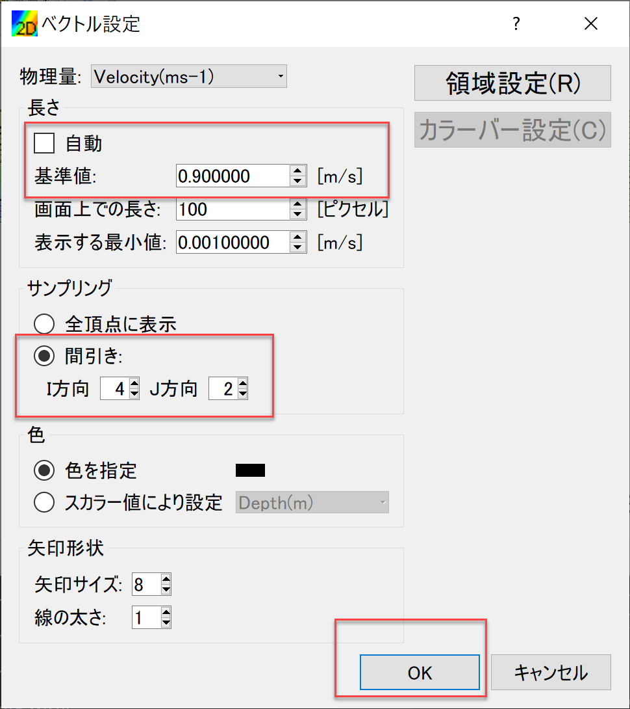

   : [Arrow Settings]

Put the [Time Scale Bar] back to zero, select [Animation]->[Srart/Stop] to
start animation as :numref:`02_hyoji3`.

.. _02_hyoji3:

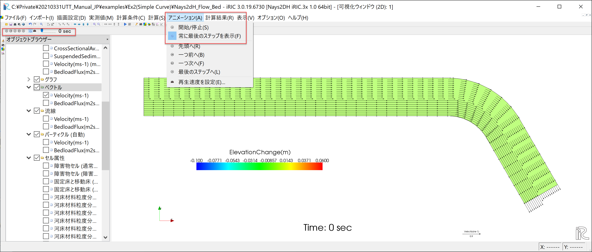

   : [Launch Animation]

As shown in :numref:`02_hyoji4`, it is shown that the bed elevation change reached an equilibrium.

.. _02_hyoji4:

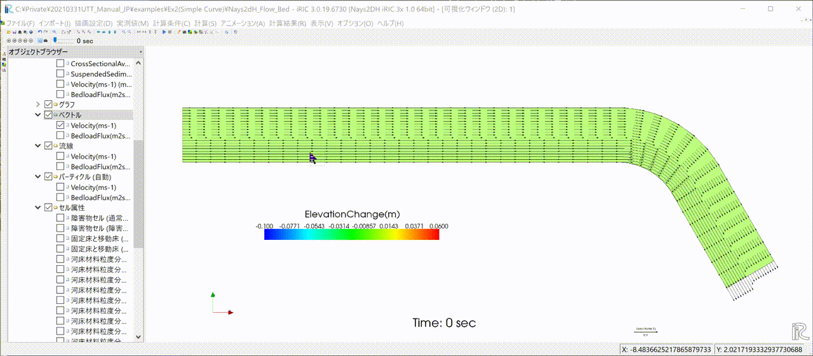

   : Animation of velocity vectors and bed elevation changes

Export the Computational Results
-----------------------------------

In order to use the calculated bed elevation as an boundary conditions for the quasi-3D flow calculation 
by Nays2d+ in the next section, we export the calculated results to a text file.
As shown in :numref:`02_export`, select [File]->[Export]->[Calculation Result].

.. _02_export:

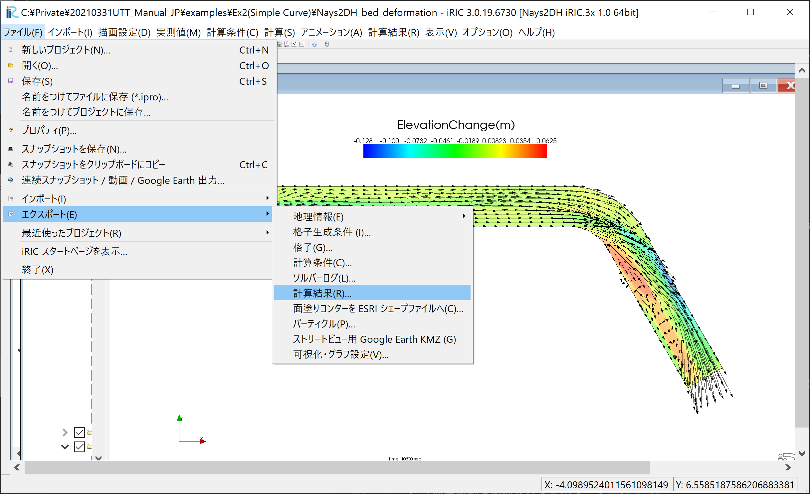

   : Exporting Computational Results(1)

When the [Export Calculation Result] setting window (:numref:`02_export2`) is appeared, 
choose [Format] as [Topography Files(\*.tpo)].

.. _02_export2:

.. figure:: images/02/export2.png
   :align: center
   :width: 300pt

   : Exporting Computational Results(2)

The output folder can be any name, and uncheck the checkbox at [All timesteps],
and set [Start] and [End] as 10,800.
Then click [OK] to complete the export of the calculation Results
:numref:`02_export3`. 

.. _02_export3:

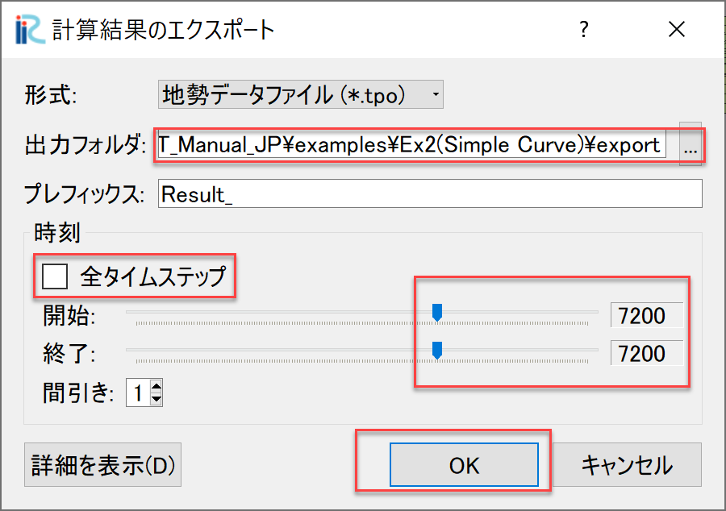

   : Exporting Computational Results(3)

The exported calculation results are stored in the specified folder.
As shown in :numref:`02_export4`, many files contain different values as water depth, 
velocity, sediment transport rate, riverbed elevations, and so on, however, since only 
the riverbed elevation is used for the flow calculations in the next section, 
all files except [Result_1_Elevation(m).tpo] can be deleted.

.. _02_export4:

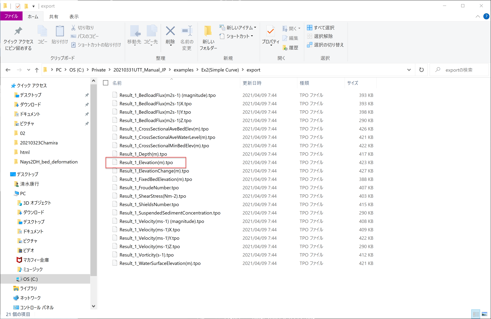

   : Exporting Computational Results(4)

Quasi-3D Flow Calculation by Nays2d+
=======================================

Selecting a Solver
---------------------

From the iRIC startup screen, click [Create New Project], and select 
[Nays2d+] in the :numref:`02_select2`, and press [OK].

.. _02_select2:

.. figure:: images/02/select2.png
   :align: center
   :width: 450pt

   : Solver selection of Nays2d+

Importing Computational Grid, Channel Bed Elevation and Mapping
---------------------------------------------------------------------

Importing Grid
^^^^^^^^^^^^^^^^^

From the main menu, select [Import]->[Grid], and choose [Case1.cgn] in the folder of [Nays2DH_floe_bed] which 
was created in the previous section.  While importing, a warning as 
:numref:`02_koshi10` is coming out, press [Yes], and complete importing grid (:numref:`02_koshi11`).

.. _02_koshi10:

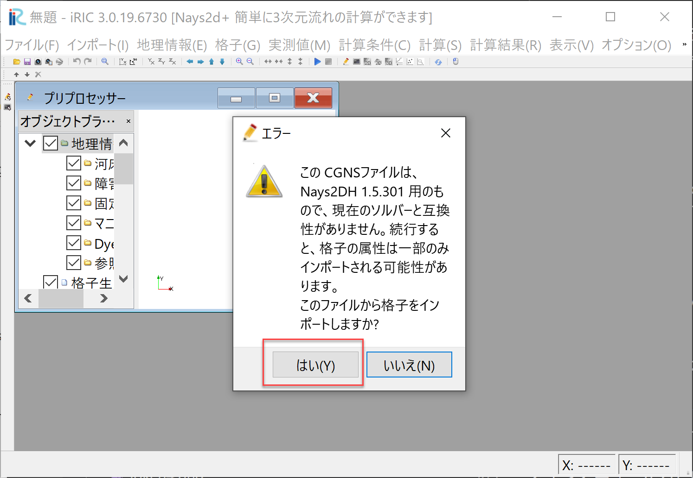

   : [Warning]

.. _02_koshi11:

.. figure:: images/02/koshi11.png
   :align: center
   :width: 100%

   : [Grid import complete]

Import Bed Elevation
^^^^^^^^^^^^^^^^^^^^^^^^

From the main menu, select [Import]->[Geographic Data]->[Elevation](:numref:`02_import2`).

.. _02_import2:

.. figure:: images/02/import2.png
   :align: center
   :width: 100%

   : Import Elevation

In the import file selection window, :numref:`02_import3`, assign the file [Results_1_Elevation(m).tpo], 
which was exported from Nays2dH calculated results in the previous section.

.. _02_import3:

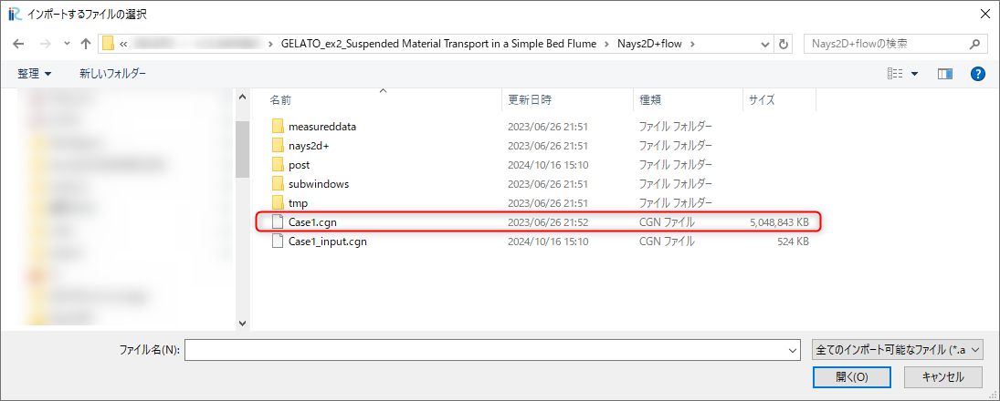

   : Select bed elevation file to import

:numref:`02_import4` appears, but if there is no particular need to thin out the data, 
you can leave it as it is, and press [OK] to complete the import the [Bed Elevation]
(:numref:`02_import5`).

.. _02_import4:

.. figure:: images/02/import4.png
   :align: center
   :width: 50%

   : Import Bed Elevation (Setting Thinning)

.. _02_import5:

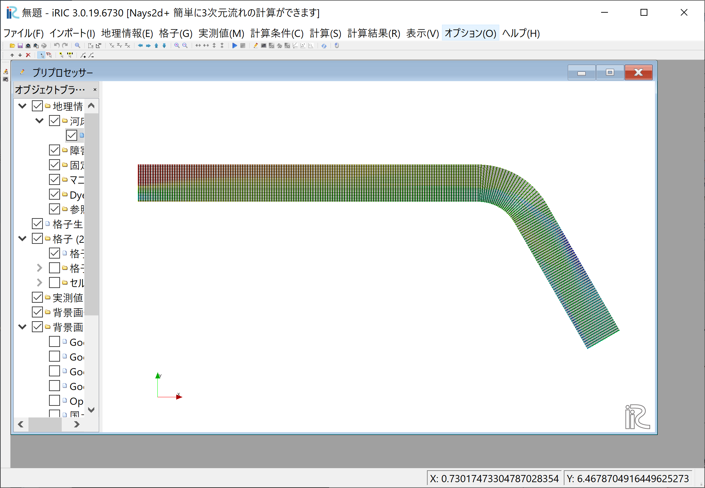

   : Bed Elevation Data Import Completed

Execute Mapping
^^^^^^^^^^^^^^^^^^^

The imported bed elevation data is mapped onto the imported computational grid.
Select [Grid]->[Attribute Mapping]->[Execute] as :numref:`02_mapping2`.

.. _02_mapping2:

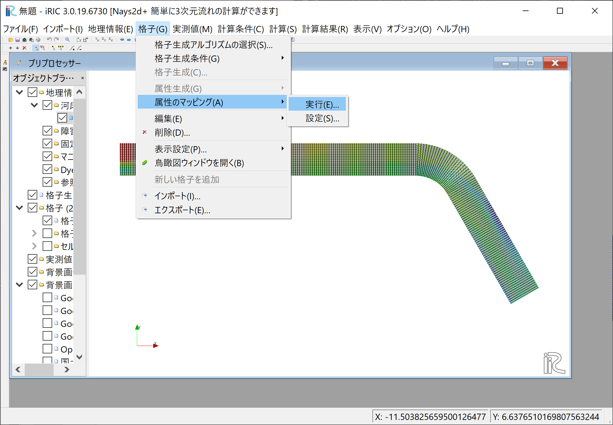

   : 「Execute Mapping」

As :numref:`02_mapping3`, you will be asked which [Geographic Data] to be mapped.
Put check mark in the box of [Elevation(m)], and press [OK].

.. _02_mapping3:

.. figure:: images/02/mapping3.png
   :align: center
   :width: 200pt

   : Selection of the Mapping Item

When the mapping is completed, press [OK] as :numref:`02_mapping4`.

.. _02_mapping4:

.. figure:: images/02/mapping4.png
   :align: center
   :width: 250pt

   : Mapping Completed

Setting Calculation Condition for Nays2d＋
--------------------------------------------

In the window of [Calculation Condition] which appears when you select [Calculation Condition]->[Setting],
set parameters in the [Groups] of [Discharge and downstream water surface elevation], 
[Time and bed erosion parameters], [Boundary Condition], [Other computational parameters] and
[3D Velocity Profile] as,  
:numref:`02_joken6`, 
:numref:`02_joken7`,
:numref:`02_joken8`,
:numref:`02_joken9`, and
:numref:`02_joken10`, respectively.

.. _02_joken6:

.. figure:: images/02/joken6.png
   :align: center
   :width: 100%

   : Discharge and downstream water surface elevation

.. _02_joken7:

.. figure:: images/02/joken7.png
   :align: center
   :width: 100%

   : Time and bed erosion parameters

.. _02_joken8:

.. figure:: images/02/joken8.png
   :align: center
   :width: 100%

   : Boundary Condition

.. _02_joken9:

.. figure:: images/02/joken9.png
   :align: center
   :width: 100%

   : Other computational parameters

.. _02_joken10:

.. figure:: images/02/joken10.png
   :align: center
   :width: 100%

   : 3D Velocity Profile

In addition, while in the settings of the [Discharge and downstream water surface elevation], 
:numref:`02_joken6`,  press [Edit] and set discharge data in in the 
[Time series of discharge and downstream stare] setting window as 
:numref:`02_joken11`.

.. _02_joken11:

.. figure:: images/02/joken11.png
   :align: center
   :width: 100%

   : Setting the time series of discharge Data

When you finish setting all the calculation condition, press [OK] in the
[Calculation Condition] window. 

Execute Nays2d+
--------------------------

We will skip the explanation of how to executing Nays2d+ because it is exactly same as other
solvers.  However, it is recommended that you save the project before running the calculation. 
In this case, we save the file to a project named [Nays2d+Flow].

.. _02_save_project2:

.. figure:: images/02/save_project2.png
   :align: center
   :width: 100%

   : Save project(Nays2d+Flow)

The results are saved in a CGNS file named [Case1.cgn], which will be used for the tracer tracking 
computation of GELATO as input data.  Be sure to save the result using 
[Calculation Result]->[Save] even when the calculation is finished.
(:numref:`02_jikko4`).

.. _02_jikko4:

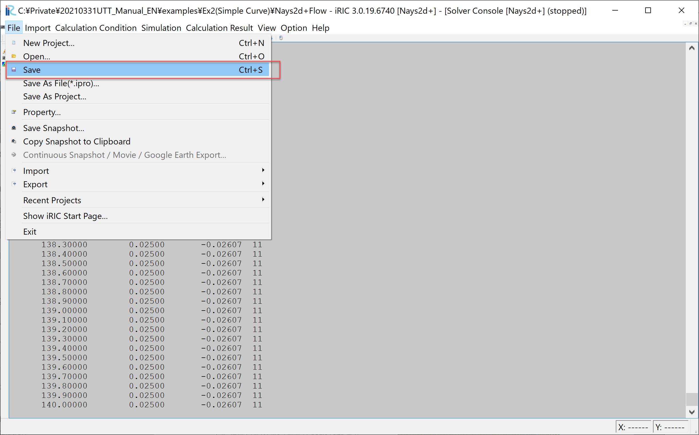

   : Save the Results of the Computation (Don't Forget!)

Tracer Tracking by GELATO 
=======================================

Select a Solver
------------------

From the iRIC startup screen, select [New Project], and in the solver selection screen appears. 
Select "GELATO" and click "OK" (:numref:`02_select_GELATO`).

.. _02_select_GELATO:

.. figure:: images/02/select_GELATO.png
   :align: center
   :width: 600pt

   : Select and Launch GELATO

Import Grid
------------------

Right click [Grid(No Data)] and select [Import] as :numref:`02_import_grid1`.

.. _02_import_grid1:

.. figure:: images/02/import_grid1.png
   :align: center
   :width: 100%

   : [Import Grid(1)]

From the [Select Import File] window as :numref:`02_import_grid2`,
choose [Case1.cgn] in the folder [Nays2d+Flow] which is produced 
by the [Nays2d+] calculation in the previous section.

.. _02_import_grid2:

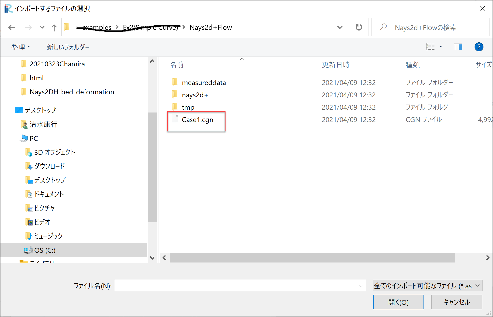

   : [Import Grid(2)]

Press [Yes] button when warning message is coming out as 
:numref:`02_import6`, and the grid import is completed as :numref:`02_import7`.

.. _02_import6:

.. figure:: images/02/import6.png
   :align: center
   :width: 400pt

   : [Warning Message]

.. _02_import7:

.. figure:: images/02/import7.png
   :align: center
   :width: 100%

   : [Grid Import Completed]

Tracer Tracking Simulation by GELATO
-------------------------------------

Setting Simulation Condition
^^^^^^^^^^^^^^^^^^^^^^^^^^^^^^^^^

From the main menu bar, when you select [Calculation condition]->[Setting]. 
[Calculation Condition] window appears, and in this window,
set parameters in the [Groups] of [Basic Settings], [Normal Tracers Supplying Condition] 
and [Diffusion Condition], as
:numref:`02_joken20`, 
:numref:`02_joken21`, and  
:numref:`02_joken22`, respectively.
In this section, we first perform tracer tracking without considering the effect 
of sub-grid turbulence.

.. _02_joken20:

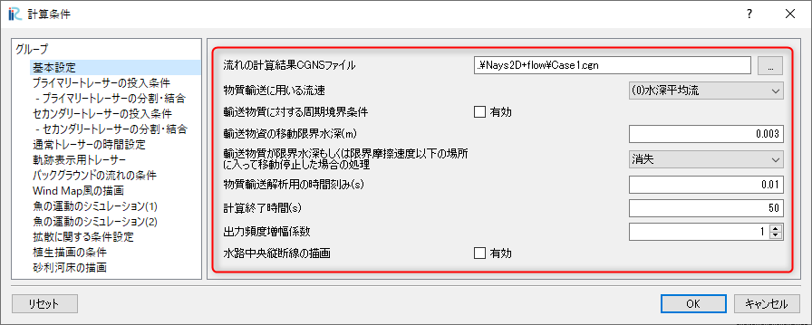

   : Basic Settings

.. _02_joken21:

.. figure:: images/02/joken21.png
   :align: center
   :width: 600pt

   : Primary Tracers Supplying Condition

.. _02_joken22:

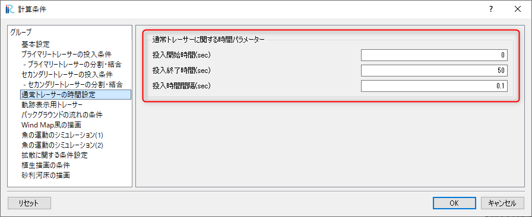

   :Time Settings for Normal Tracers

.. _02_joken23:

.. figure:: images/02/joken23.png
   :align: center
   :width: 600pt

   : Diffusion Condition

In addition.Figure 100 The [CGNS file to read the flow calculation results] in the 
[CGNS file to read the flow calculation results] is the same as the one in the previous section
[Flow calculation with Nays2d+]. 
Select [Case1.cgn] in the [Nays2d+Flow] project folder where you saved the results of ( Figure 103)

In addition, the [Flow information input file] in :numref:`02_joken20`,
is the same file with the [Case1.cgn] which was produced by the flow simulation of [Nays2d+]
in the previous section  (:numref:`02_joken24`).

.. _02_joken24:

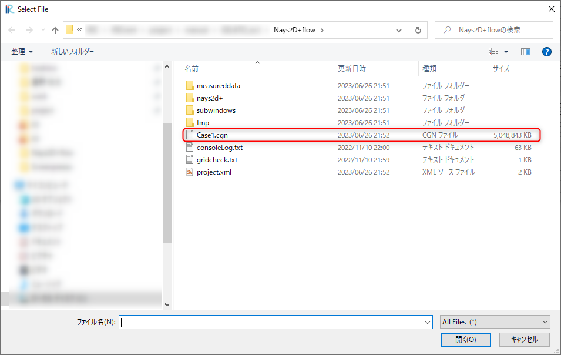

   : Assign CGNS file to read flow simulation results

Run GELATO
^^^^^^^^^^^^^^

From the main menu, select [Simulation]]->[Run], then you will be asked to save project as usual,
save project as recommended.
( :numref:`02_save_project3`).

.. _02_save_project3:

.. figure:: images/02/save_project3.png
   :align: center
   :width: 400pt

   : Saving GELATO Project(1)

In the :numref:`02_save_project4`,  
either [Save as file (\*.ipro)] or [Save as Project] will do, but in this example, 
the file is saved as [GELATO1]. 

.. _02_save_project4:

.. figure:: images/02/save_project4.png
   :align: center
   :width: 250pt

   : Saving GELATO Project(2)

When the computation starts, :numref:`02_jikko20` appears, and when the computation finishes, 
:numref:`02_jikko21` appears. Press [OK] to finish computation. 

.. _02_jikko20:

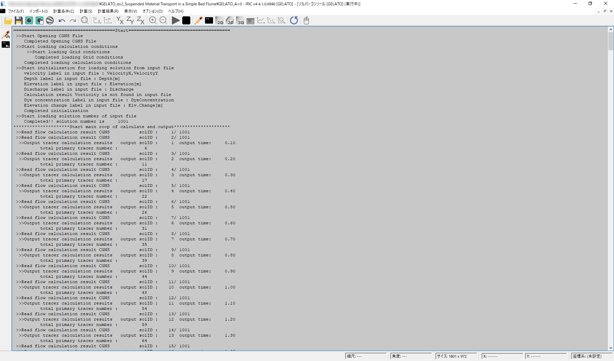

   : Execution of GELATO(1)

.. _02_jikko21:

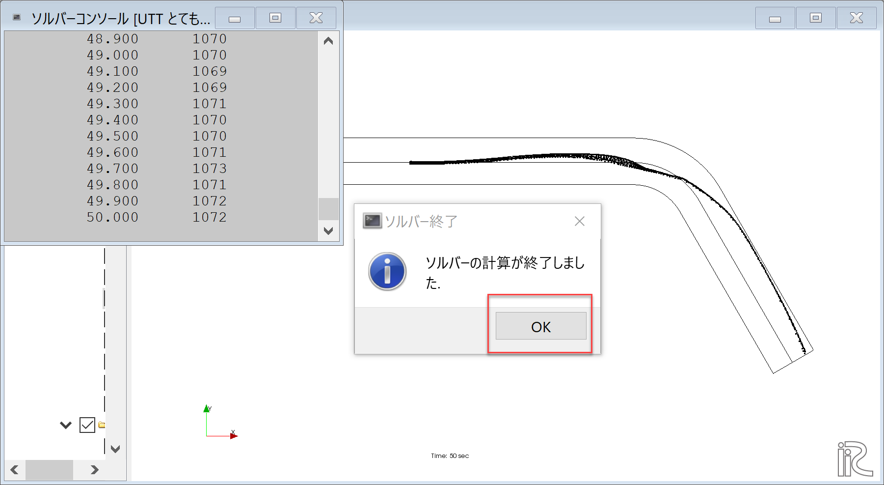

   : Execution of GELATO(2)

Showing the Results of GELATO
^^^^^^^^^^^^^^^^^^^^^^^^^^^^^

From the main menu, select [Calculation Result]->[Open new 2D Post Processing Window], and
the calculation results are shown (:numref:`02_kekka20`)

.. _02_kekka20:

.. figure:: images/02/kekka20.png
   :align: center
   :width: 100%

   : [2D Post Processing Window]

Since the orientation of the :numref:`02_kekka20` is the opposite to the  
experimental image shown at the beginning of this chapter :numref:`02_jikken`,
press the 90° rotation mark twice 
to rotate 180° (:numref:`02_kekka21`).

.. _02_kekka21:

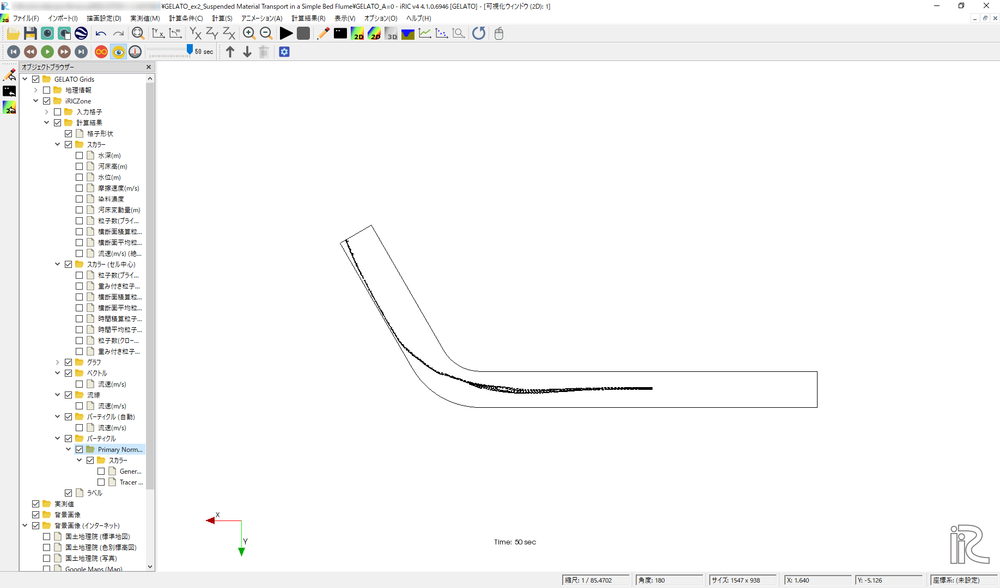

   : 2D Post Processing Window 180° rotate

Since the [Time] display is so small that it's hard to see, select [Time]->[Properties] in the object browser
(:numref:`02_jikoku1`), 
display [Time Setting] and set the font size appropriately large (:numref:`02_jikoku2`).

.. _02_jikoku1:

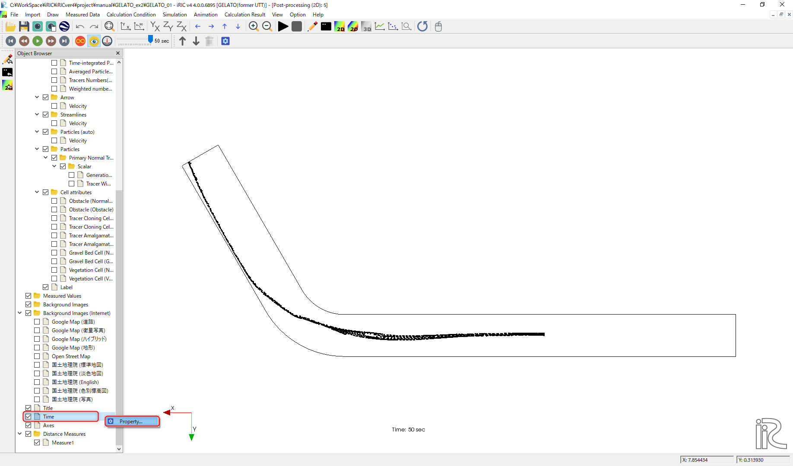

   : Time Setting(1)

.. _02_jikoku2:

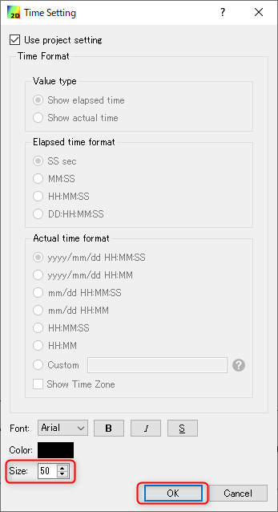

   : Time Setting(2)

As shown in :numref:`02_anime1`, put time bar back to 0, and from the main menu,
select [Animation]->[Start/Stop], then the animation starts( :numref:`02_GELATO00`).

.. _02_anime1:

.. figure:: images/02/anime1.png
   :align: center
   :width: 100%

   : Starting Animation

.. _02_GELATO00:

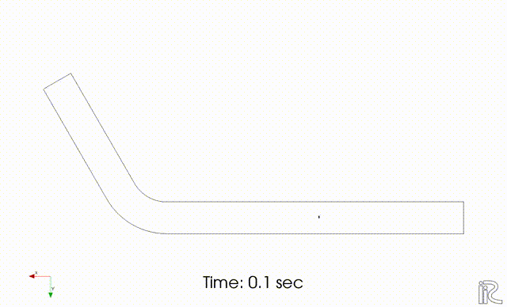

   : Tracer Animation (Turbulent Diffusivity A=0)

There is almost no diffusion and the tracers are just flowing straightly.

Comparison of the Turbulent Diffusivity
^^^^^^^^^^^^^^^^^^^^^^^^^^^^^^^^^^^^^^^^^^

Select [Calculation Condition]->[Setting] and open [Calculation Condition] window.
As shown in :numref:`02_A01`, set in the [Group]->[Diffusion Condition], [Diffusivity Correction]->[Yes] 
and set the value [A=10] of the [Diffusivity Parameter] 

.. _02_A01:

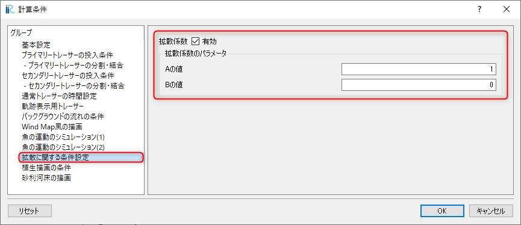

   : Random Walk Parameter Setting (A=1)

.. _02_GELATO01:

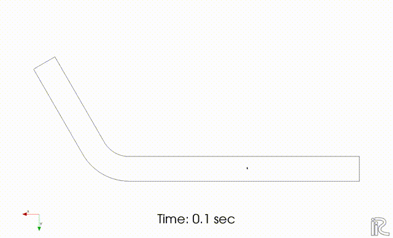

   : Animation of the Tracer Motion (A=1)

In the same manner, if we do the simulation with [A=5], [A=10] and [A=50], the results becomes as
:numref:`02_GELATO05`, :numref:`02_GELATO10` and :numref:`02_GELATO50`.

.. _02_GELATO05:

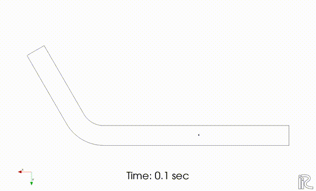

   : Animation of the Tracer Motion (A=5)

.. _02_GELATO10:

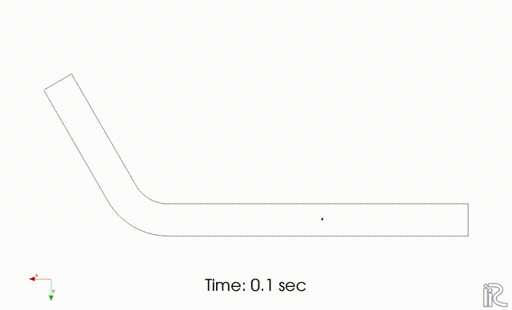

   : Animation of the Tracer Motion (A=10)

.. _02_GELATO50:

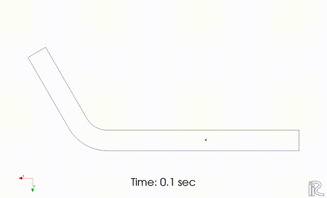

   : Animation of the Tracer Motion (A=50)

When we compared with the experimental results of the :numref:`02_jikken`, 
it seem that the case with A=10, :numref:`02_GELATO10`, is the closest to the experiment. 

Cloning of the Tracers
^^^^^^^^^^^^^^^^^^^^^^^^^^

In the main menu, select [Calculation Condition]->[Setting] to show [Calculation Condition].
In the [Calculation Condition] window, select [Tracer Cloning and Amalgamation], set parameters as
:numref:`02_clone01`.
Select [Diffusion Condition] and set [A=10] and press[OK] as :numref:`02_clone01-1`.
Then execute the GELATO solver by choosing [Simulation]->[Run], and show the results (:numref:`02_clone10`).

.. _02_clone01:

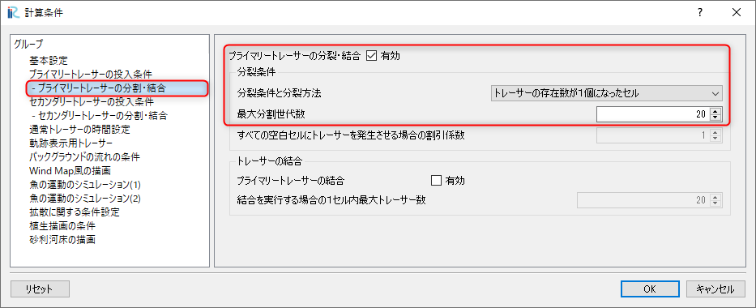

   : Setting the Tracer Cloning(1)

.. _02_clone01-1:

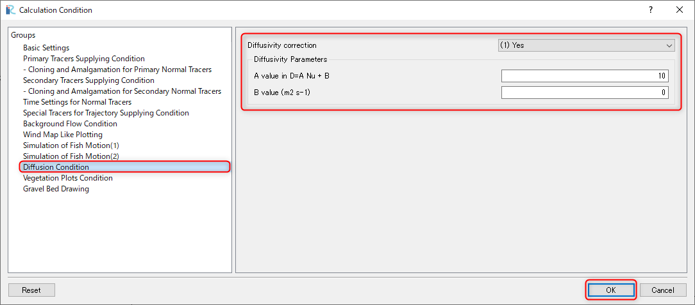

   : Setting the Tracer Cloning(2)

.. _02_clone10:

.. figure:: images/02/clone10.gif
   :align: center
   :width: 100%

   : Animation of Tracer Cloning (Maximum Generation 20, A=10)

The spread range of the tracers in :numref:`02_jikken` is close to the diffusion range of the green dye 
in the experimental movie.  The number of tracers appears to be enormous, but 
if you put check marks in [Particles]->[Scalars]->[Generations] in the object browser, 
generations of the tracers are displayed as :numref:`02_clone02`.

.. _02_clone02:

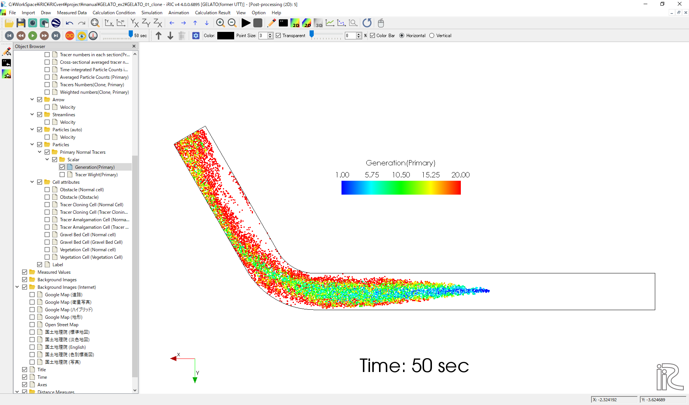

   : Color-coded View of the Clone Generations

When this is animated, it becomes as :numref:`02_clone10_gen`.

.. _02_clone10_gen:

.. figure:: images/02/clone10_gen.gif
   :align: center
   :width: 100%

   : Tracers Clone Animation(Maximum 20 Generations, A=10, Color-coded View)

As described in  :ref:`Overview` , the substantial weight in the 10th generation is 
W=0.00195, and in the 20th generation is W=0.00000195. 
Therefore, :numref:`02_clone02`, the concentrations of the tracers of green, yellow, red, etc. 
are logarithmically lower than that of the central blue tracers. 
To see the real concentration, the substantial concentration in each cell is visualized by 
the following procedure. 

1. Uncheck the check box at [Scalar] in the object browser (:numref:`02_concent1`).

.. _02_concent1:

.. figure:: images/02/concent1.png
   :align: center
   :width: 100%

   : Uncheck the check box by [Scalar] 

2. Put check mark at [Scalar(Cell Center)] and [Weighted numbers of tracers] in the Object Browser
(:numref:`02_concent2`).

.. _02_concent2:

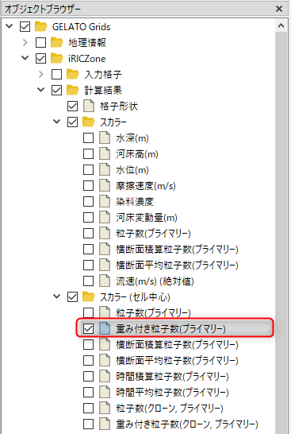

   : Put check mark at [Weighted numbers of tracers]

3. Right click [Weighted numbers of tracers] and press [Property]

.. _02_concent3:

.. figure:: images/02/concent3.png
   :align: center
   :width: 100%

   : [Weighted numbers of tracers]->[Property]

4. In the [Scalar Setting] window, setting as shown :numref:`02_concent1`. 

.. _02_concent4:

.. figure:: images/02/concent4.png
   :align: center
   :width: 70%

   : Scalar Settings

5. As shown in :numref:`02_concent7`, put time bar back to 0, and from the main menu, select [Animation]->[Start/Stop],
then the animation starts( :numref:`02_concent8`).

.. _02_concent7:

.. figure:: images/02/concent7.png
   :align: center
   :width: 100%

   : Starting Animation

.. _02_concent8:

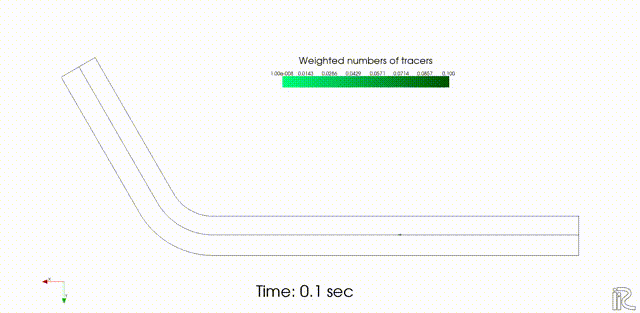

   : Animation of the tracer concentration considering the weight

The diffusion situation is similar to that of the green dye in the experimental movie of
:numref:`02_jikken`. 

Flow Visualization using Tracer Cloning
-----------------------------------------------

Flow visualization using tracer cloning is shown in this section.
In the main menu, click [Calculation Condition], and set parameters in the [Group] of
[Normal Tracers Supplying Condition] and [Tracer Cloning and Amalgamation] as 
:numref:`02_settei1` and :numref:`02_settei2`, respectively, and press [OK].

:numref:`02_settei1` 

.. _02_settei1:

.. figure:: images/02/settei1.png
   :align: center
   :width: 600pt

   : Calculation Condition Setting(1)

.. _02_settei2:

.. figure:: images/02/settei2.png
   :align: center
   :width: 600pt

   : Calculation Condition Setting(2)

Then after running  the GELATO solver.
in the [Object Browser], remove check mark from [Weighted numbers of tracers], put 
check marks in boxes at [Particles], [Scalar] and remove the check mark form the [Generation].

From the main menu, select [Animation]->[Srat/Stop], and the animation with evenly distributed tracers in the
whole channel is visualized.

.. _02_kashika:

.. figure:: images/02/kashika.gif
   :align: center
   :width: 100%

   : Flow Visualization with Virtual tracers

Swimming Fish Simulation
---------------------------------

Set the following parameters in the [Computation of Fish Motion] in the 
[Calculation Condition] window menu followed by selecting 
[Calculation Condition]->[Setting] in the main menu.

.. _02_fish1:

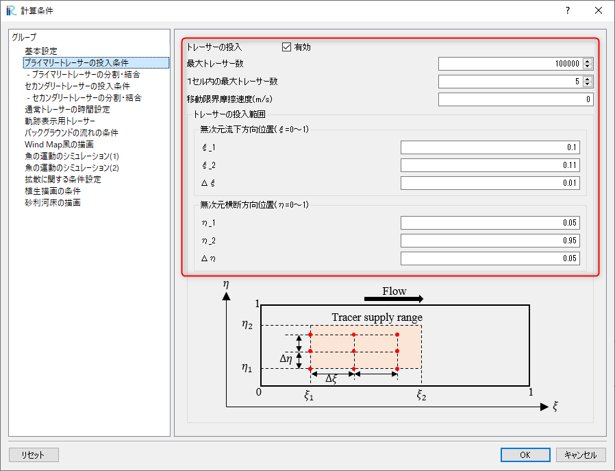

   : Setting Condition or Fish(1)

.. _02_fish2:

.. figure:: images/02/fish2.png
   :align: center
   :width: 600pt

   : Setting Condition for Fish(2)

.. _02_fish3:

.. figure:: images/02/fish3.png
   :align: center
   :width: 600pt

   : Setting Condition of Fish(3)

.. _02_fish4:

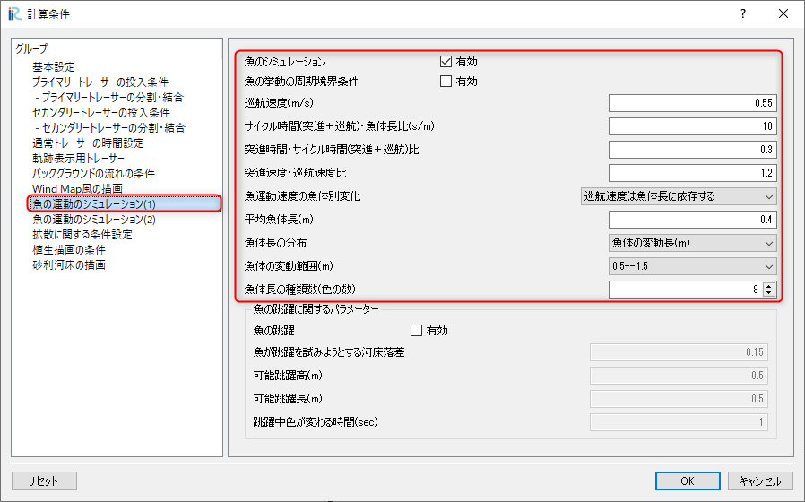

   : Setting Condition of Fish(4)

.. _02_fish5:

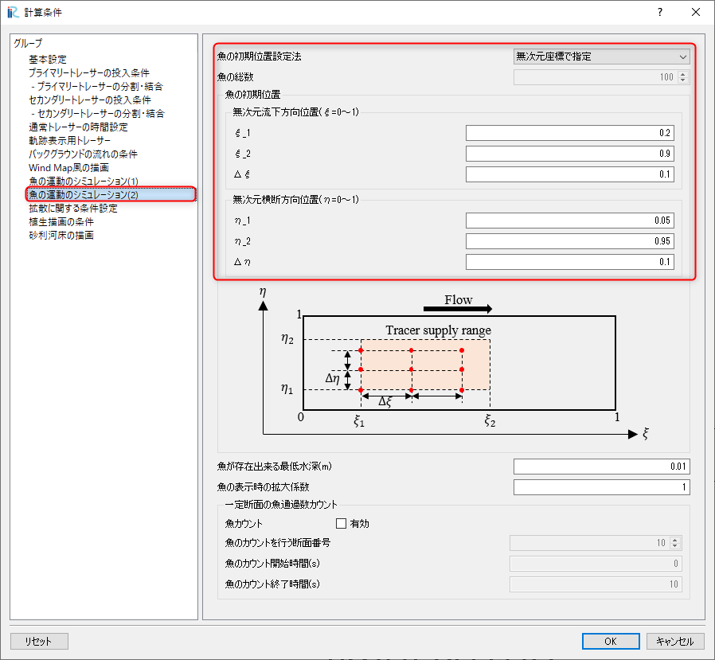

   : Setting Condition of Fish(5)

After setting these parameters, run the solver by [Simulation]->[Run].
Once close the existing [2D Post-processing 2D window], open a new 
[2D Post-processing 2D window], put check mark on [Polygon]->[Fish]->[Type] 
as :numref:`02_fish6`, 
and select [Animation]->[Start/Stop].  Then :numref:`02_fish7` is played.

.. _02_fish6:

.. figure:: images/02/fish6.png
   :align: center
   :width: 100%

   : Choosing Fish Animation

.. _02_fish7: 

.. figure:: images/02/fish.gif
   :align: center
   :width: 70%

   : Swimming Fish Animation
  
Driftwood Tracking by NaysDW2 and Visualization
===================================================

In this section, driftwood tracking simulation by NaysDW2 (Nays Driftwood 3D) is shown.

Select a Solver
------------------

From the iRIC startup screen, click [Create New Project], and select 
[NaysDw2(Simple 2D Driftwood Tracker)] as shown in :numref:`02_select_Dw2`, and press [OK].

.. _02_select_Dw2:

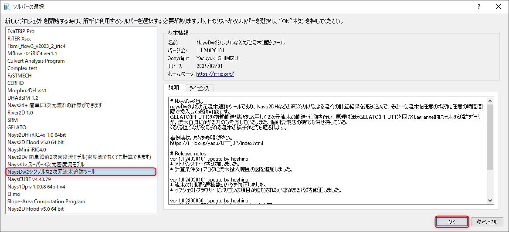

   : Selecting [NaysDw2] (Simple 2D Driftwood Tracker)

Import Computational Grid
-----------------------------

As shown in :numref:`02_import_grid3`, from the [Object Browser], right click
[Grid(No data)], and press [Import]

.. _02_import_grid3:

.. figure:: images/02/import_grid3.png
   :align: center
   :width: 100%

   : [Import Grid(1)]

When the file selection window appears, 
select [Case1.cgn] in the [Nays2d+Flow] folder in which the computational
results of the [Nays2d+] stored.
(:numref:`02_import_grid4`)

.. _02_import_grid4:

   : [Import Grid(2)]

Neglect the waring message as :numref:`02_import6`, press [Yes], and the grid importing is completed
(:numref:`02_import9`).

.. _02_import8:

.. figure:: images/02/import6.png
   :align: center
   :width: 400pt

   : [Warning Message]

.. _02_import9:

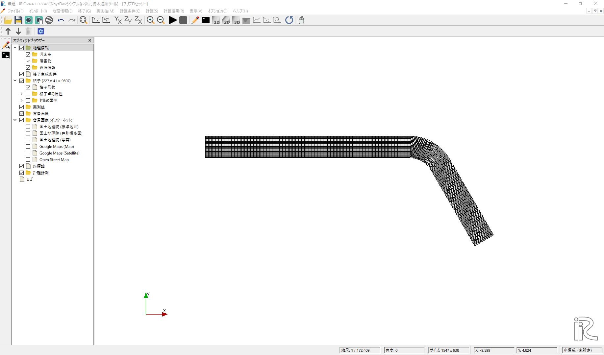

   : [Grid Import complete]

Setting Condition
------------------

From the main menu, select [Calculation Condition]->[Setting],and set the calculation condition 
as follows.

In the [Calculation Condition] window, press file selection bar as :numref:`02_dw1`.

.. _02_dw1:

.. figure:: images/02/dw1.png
   :align: center
   :width: 600pt

   : Select CGNS File to Read(1)
   
In the [Select File] window, :numref:`02_dw2`, select [Case1.cgn] which contains the calculation results of
the [Nays2d+] in the previous section.

.. _02_dw2:

   : Select CGNS File
   
Set other parameters in [Basic Setting] as :numref:`02_dw3`. 

.. _02_dw3:

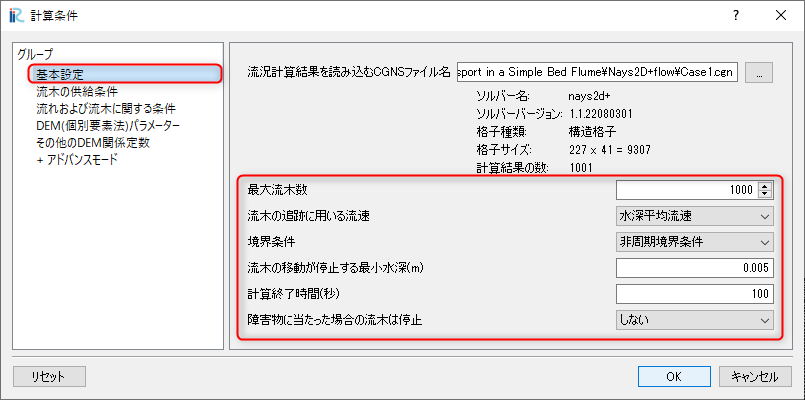

   : Other settings in [Basic Setting]

Set parameters in [Driftwood Feeding Condition] as :numref:`02_dw4`. 

.. _02_dw4:

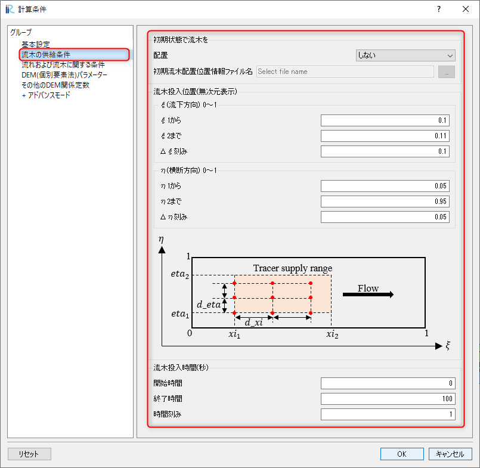

   : [Driftwood Feeding Condition]

Set [DEM Coefficients] parameters as :numref:`02_dw5`, and press [OK]. 

.. _02_dw5:

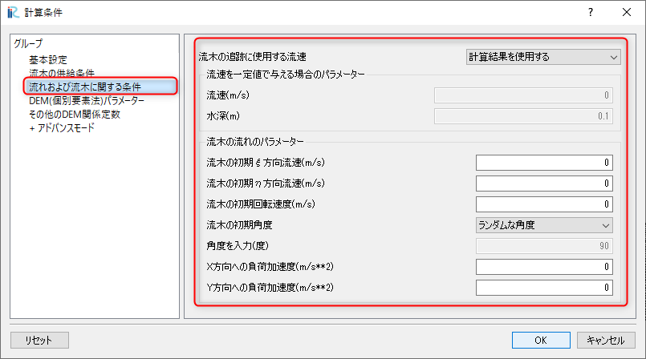

   : [DEM Coefficients]

Run Driftwood Simulation
----------------------------

From the main menu, select [Simulation]->[Run] as :numref:`02_dw6`. 

.. _02_dw6:

.. figure:: images/02/dw6.png
   :align: center
   :width: 100%

   : [Simulation]->[Run]

When you are asked [Do you want to save?] as :numref:`02_dw7`, press [Yes] and save the project.

.. _02_dw7:

.. figure:: images/02/save_project3.png
   :align: center
   :width: 400pt

   : [Do you want to save ?]

As :numref:`02_dw8`, when you are asked [How to save the project], in this example,
select [Save as project], and press [OK]. Choose an empty folder to save project, and
press [Select Folder].

.. _02_dw8:

.. figure:: images/02/save_project4.png
   :align: center
   :width: 250pt

   : [How to save project]

.. _02_dw9:

When the calculation starts, :numref:`02_dw10` is displayed, and
:numref:`02_dw11` is appear when the calculation ends. 
Then click [OK] to finish calculation. 

.. _02_dw10:

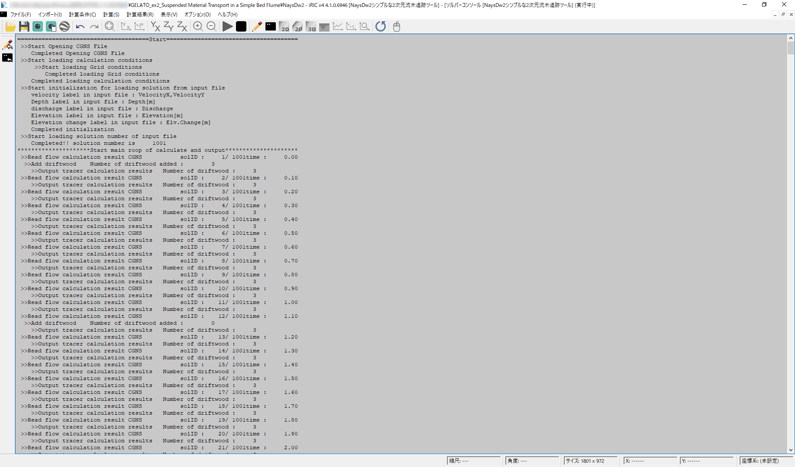

   : Solver Running 

.. _02_dw11:

   : Calculation finished

Visualization of driftwood motion
--------------------------------------

From the main menu, select [Calculation Result]->[Open New 2D Post-processing Window] as :numref:`02_dw12`.

.. _02_dw12:

.. figure:: images/02/dw12.png
   :align: center
   :width: 100%

   : Open New 2D Post-processing Window

In the [Object Browser] of :numref:`02_dw13`, put check marks in the boxes at [iRICZone], [Scalar(node)] and 
[res_Velocity(magnitude)], right click [res_Velocity(magnitude)] and choose [Property]. 

.. _02_dw13:

.. figure:: images/02/dw13.png
   :align: center
   :width: 100%

   : Scalar Setting(1)

Set the parameters for [Scalar Settings] as :numref:`02_dw14`, and press [OK]. 

.. _02_dw14:

.. figure:: images/02/dw14.png
   :align: center
   :width: 600pt

   : Scalar Setting(2)

Set the time bar back to zero, and select [Animation]->[Start/Stop] from the main menu bar
as :numref:`02_dw15`, and start animation as :numref:`02_dw16`

.. _02_dw15:

.. figure:: images/02/dw15.png
   :align: center
   :width: 100%

   : Start Animation

.. _02_dw16:

.. figure:: images/02/dw.gif
   :align: center
   :width: 100%

   : Driftwood Tracking Animation

