[計算例 3] 実河川の流れとトレーサーの追跡計算
==========================================================

実河川ので行われた浮子観測の結果をもとに再現を行う. 
洪水時に浮子投下機から浮子を投下し、100m区間の流下時間を測定、流速を算定している. 
観測水位・流速から求められた流量2640m3/sを対象に, Nays2d+を用いて表面流を算定後, 
UTTによる浮子の再現を行う. 

Nays2d+による流れの計算
=========================

ソルバの選択
---------------

iRIC起動画面より, [Nays2d+]を起動する. 

.. _03_001:

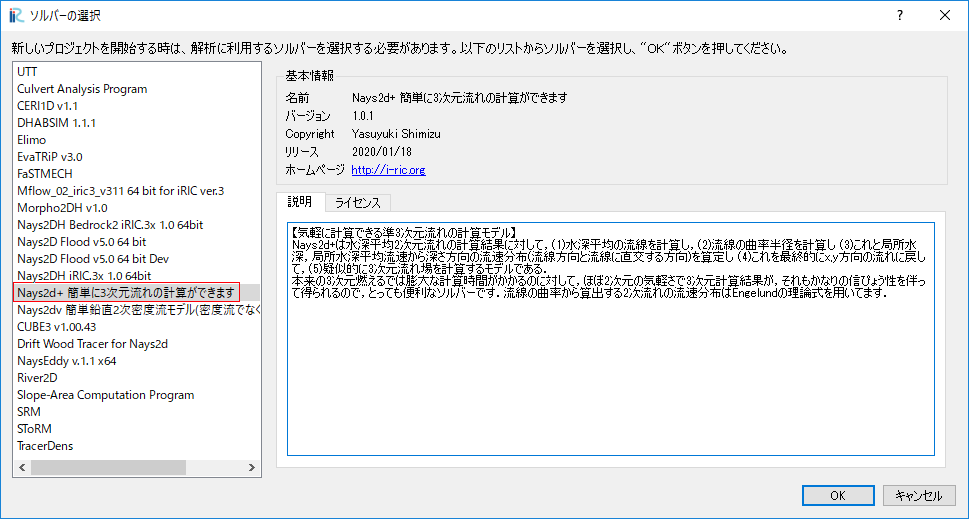

   : ソルバーの選択

計算格子と河床形状の作成
--------------------------

1)  河床高のインポート
^^^^^^^^^^^^^^^^^^^^^^^^^
[インポート] → [ 地理情報] → [河床高(m)] より、tikei.tpo（点群データ）を読み込みます。
次に点群データの間引きを選択します。ここでは間引きは行わず、1を選びます。

.. _03_002:

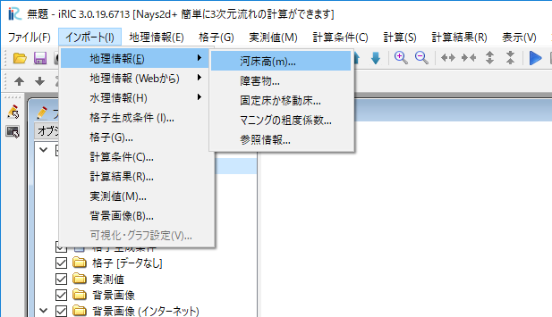

   : 河床高選択
 
.. _03_003:

.. figure:: images/03/003.png
   :width: 80%

   : 点群データ読み込み

.. _03_004:

   : 間引き

読み込んだ地形データを示します. 

.. _03_005:

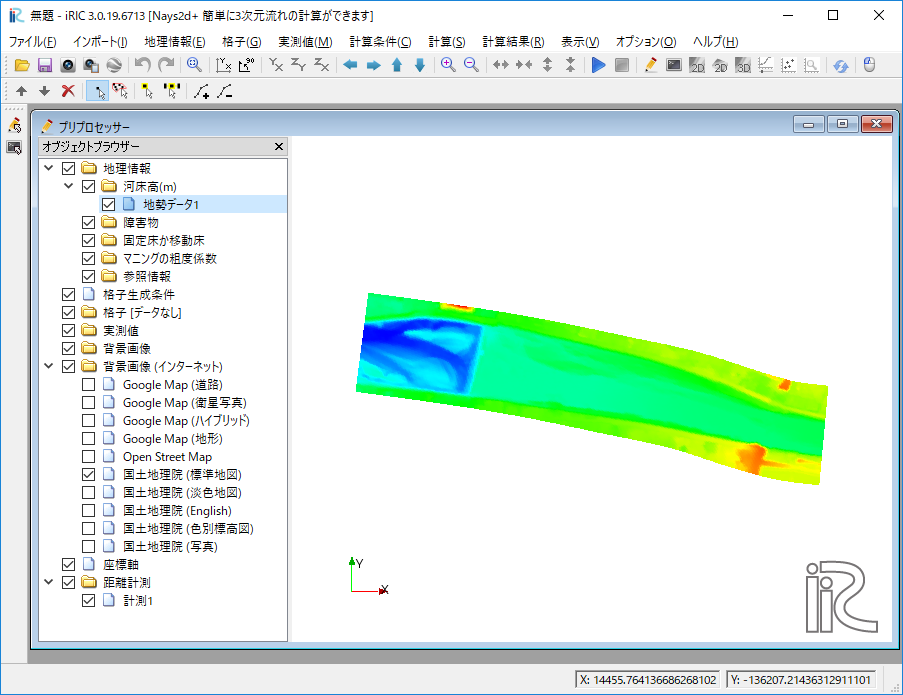

   : 地形データ

2) 背景の設定
^^^^^^^^^^^^^^^^^^^^^^^^^
[ ファイル ] → [ プロパティ ] を選択し, プロパティ画面より座標系を選択します. 

.. _03_006:

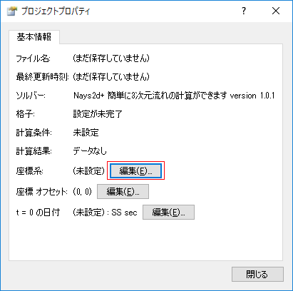

   : プロジェクトプロパティ

   

検索からJapanを打ち込み, EPSGのJapan VIを選択します. 

.. _03_007:

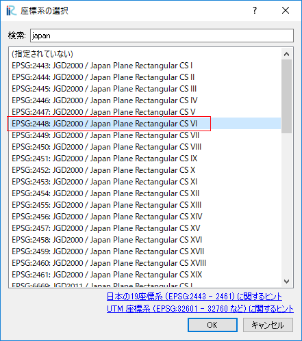

   : 座標系の選択

オブジェクトブラウザより、[背景画像(インターネット）] → [ 国土地理院(標準地図）]を選択します。
                                 
.. _03_008:

.. figure:: images/03/008.png
   :width: 80%

   : 背景の表示

3) 計算格子の選択
^^^^^^^^^^^^^^^^^^^^^^^^^
[ 格子 ] → [ 格子生成アルゴリズムの選択 ] → [ 折れ線と格子幅から生成 ]を選択する. 

.. _03_009:

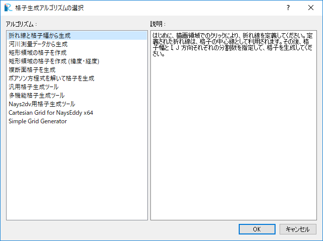

   : 格子アルゴリズムの選択

上流側から下流へ向けて中心位置を選択する. 

.. _03_010:

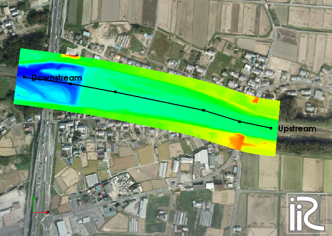

   : 中心線の選択

格子生成画面より, 格子数 ｎI:290, nJ:56, 幅W140mとする. 格子サイズは2.5m×5.0m程度となる. 

.. _03_011:

.. figure:: images/03/011.png
   :width: 80%

   : 格子生成

.. _03_012:

.. figure:: images/03/012.png
   :width: 80%

   : 格子形状

4) 橋脚の設定
^^^^^^^^^^^^^^^^^^^^^^^^^
画面左のオブジェクトブラウザより, 地勢データ1を非表示にし, 
[ 障害物 ] → [ 追加 ] → [ ポリゴン] を選択し, 橋脚位置を障害物設定する. 
また, 全格子をポリゴンで囲み通常格子とする. このとき, 通常セルは障害物セルより
下層のレイヤーに配置する. 

.. _03_013:

.. figure:: images/03/013.png
   :width: 80%

   :障害物

.. _03_014:

   :障害物セル

5) 粗度係数の設定
^^^^^^^^^^^^^^^^^^^^^^^^^
[マニングの粗度係数]よりポリゴンから全格子囲みn=0.030を入力する. 

.. _03_015:

   :粗度係数

6) 属性のマッピング
^^^^^^^^^^^^^^^^^^^^^^^^^
[ 格子 ] → [ 属性のマッピング ] → [ 実行 ]を選択する. 

.. _03_016:

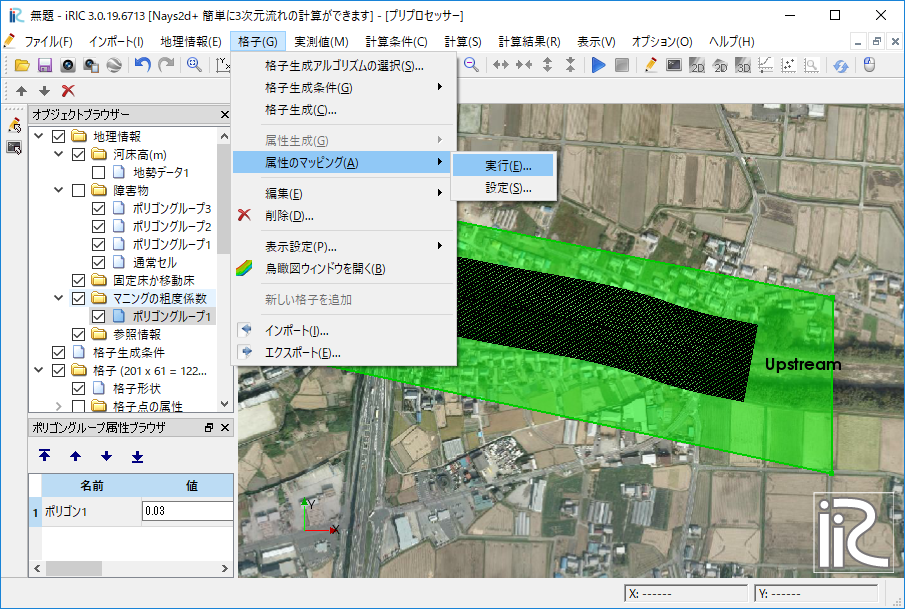

   :属性マッピング

.. _03_017:

   :属性マッピング実行

計算条件の設定
---------------------
                                 
メニューの[ 計算条件 ]より計算条件をを設定する. 
各種条件を図に示す。

.. _03_018:

.. figure:: images/03/018.png
   :width: 70%

   :流量および読み込みファイル

.. _03_019:

   :流量と下流端水位の時系列データ                              

.. _03_020:

.. figure:: images/03/020.png
   :width: 70%

   :時間および浸食に関するパラメータ      

.. _03_021:
   

   :境界条件      

.. _03_022:
   

   :他の計算条件      

.. _03_023:
   
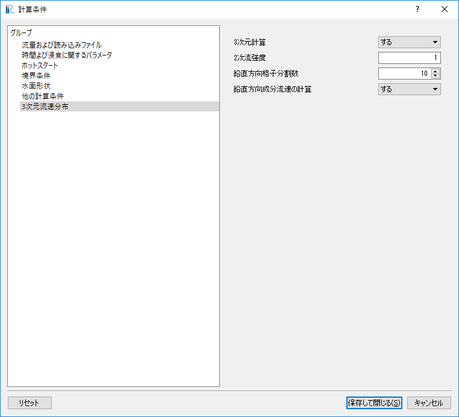

   :三次元流速分布      

計算の実行
---------------------

名前を付けてプロジェクトを保存し, 計算を実行する. 
計算が終わったら, 保存してプロジェクトを閉じます. 

UTTによる仮想トレーサーの追跡計算
=====================================

ソルバの選択
---------------------

iRICの起動画面から, [新しいプロジェクト]を選ぶと表示されるソルバの選択画面で
[UTTとても便利な多機能トレーサー追跡ツール] を選択して[OK]を押す. 

.. _03_024:
   
.. figure:: images/03/024.png
   :width: 70%

   :ソルバーの選択     

格子のインポート
---------------------

オブジェクトブラウザーの[格子(データなし)]を右クリック して, [インポート]をクリックする. 

.. _03_025:
   
.. figure:: images/03/025.png
   :width: 70%

   :ソルバーの選択     

Case1.cgn を選択する。
   
.. _03_026:

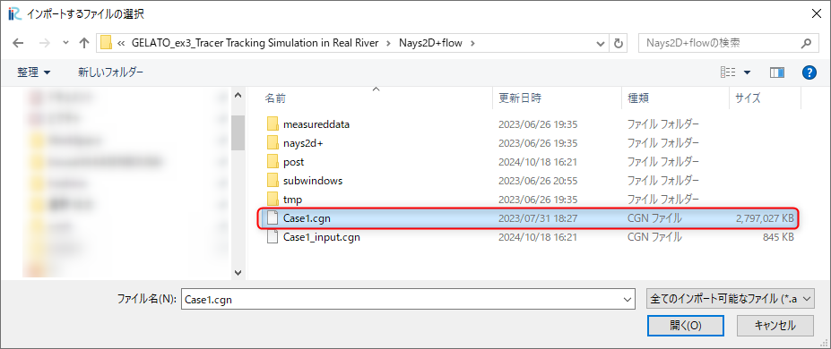

   :インポートするファイルの選択

地形データの確認
---------------------
座標系を設定する. 
メニューより[ ファイル ] → [ プロパティ] を選択する. 

.. _03_027:

.. figure:: images/03/027.png
   :width: 70%

   :プロパティの選択

プロジェクトプロパティ画面より, 座標系の [ 編集 ] を選択する. 

.. _03_028:

.. figure:: images/03/028.png
   :width: 70%

   :プロジェクトプロパティ

座標系の選択画面より, 検索に [ japan ] を入力し, [ EPSG:・・・CSVI ] を選択する.  

.. _03_029:

   :座標系の選択

オブジェクトブラウザより, 背景画像(インターネット)の国土地理院(標準地図)を選択する. 

.. _03_030:

.. figure:: images/03/030.png
   :width: 70%

   :背景画像

UTTによるトレーサー追跡計算
-----------------------------------
1) 計算条件設定
^^^^^^^^^^^^^^^^^^^^^^^^^
計算条件を示す. 

.. _03_031:

.. figure:: images/03/031.png
   :width: 70%

   :基本設定

.. _03_032:
   
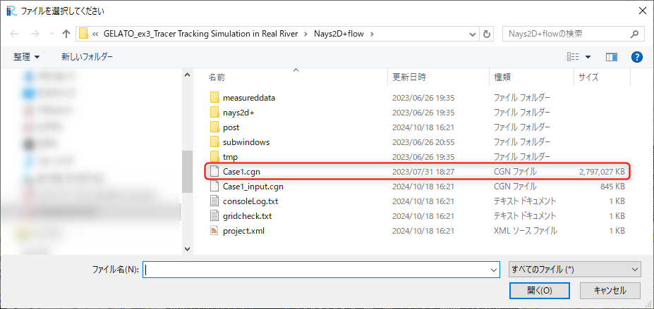

   :cgnファイル選択

.. _03_033:
   
.. figure:: images/03/033.png
   :width: 70%

   :軌跡表示を行う特別トレーサー投入条件

.. _03_034:

   :乱れの影響

2) 計算の実行
^^^^^^^^^^^^^^^^^^^^^^^^^
ファイルをプロジェクトで保存し, 計算を実行する. 

3) 計算結果の表示
^^^^^^^^^^^^^^^^^^^^^^^^^
[計算結果]より, [新しい可視化ウィンドウ(2D)]を開き, 
[背景画像（インターネット）]から[ 国土地理院（標準地図）]を選択する. 

.. _03_035:

.. figure:: images/03/035.png
   :width: 70%

   :背景画像

オブジェクトブラウザより、ポリゴンの Trajectory を右クリックし、
プロパティを選択する. 

.. _03_036:

.. figure:: images/03/036.png
   :width: 70%

   :ポリゴンのプロパティ

ポリゴン設定画面より, [ 線の幅 ] に 3 を入力する. 

.. _03_037:

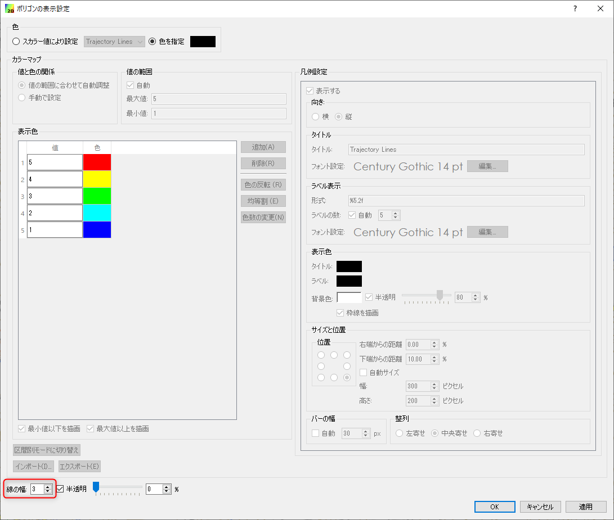

   :ポリゴン設定

オブジェクトブラウザより、[ スカラー(格子点)] の[ Velocity ] を選択し、
右クリックよりプロパティを選択する. 
スカラー設定画面より, 値を入力し, 最小値以下を描画のチェックを外す. 

.. _03_038:

.. figure:: images/03/038.png
   :width: 70%

   :スカラー設定

以上より, 浮子投下機より投下したトレーサーの軌跡の計算結果を示す. 

.. _03_039:

.. figure:: images/03/039.png
   :width: 70%

   :トレーサーの軌跡表示

   : トレーサーの軌跡アニメーション
