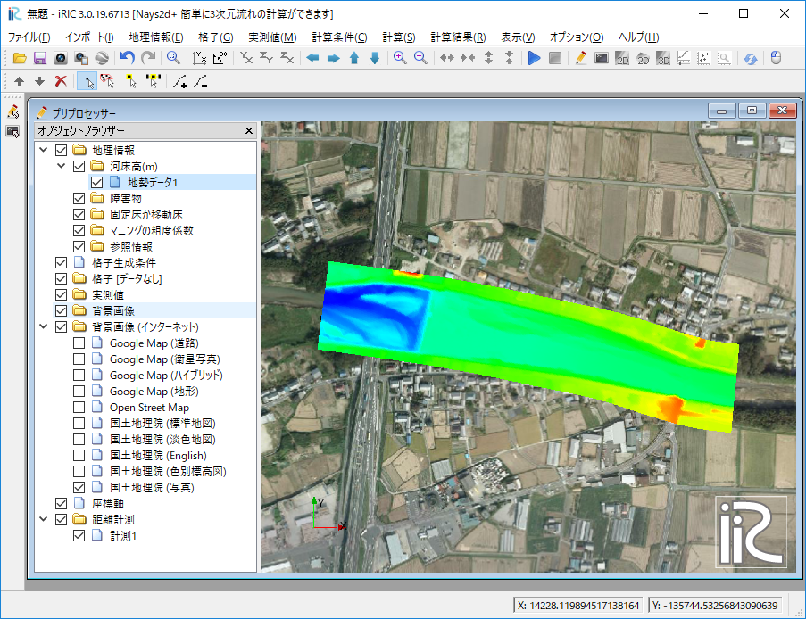
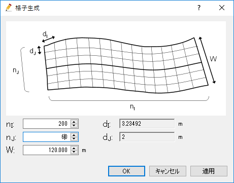
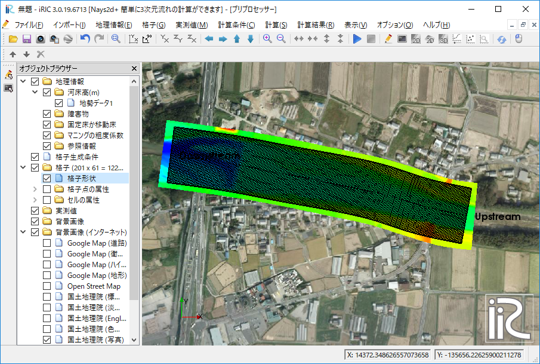
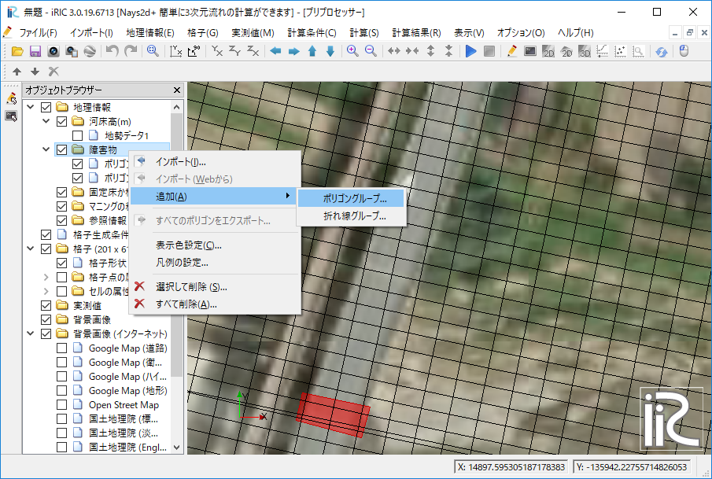
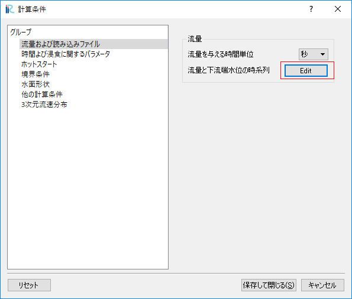
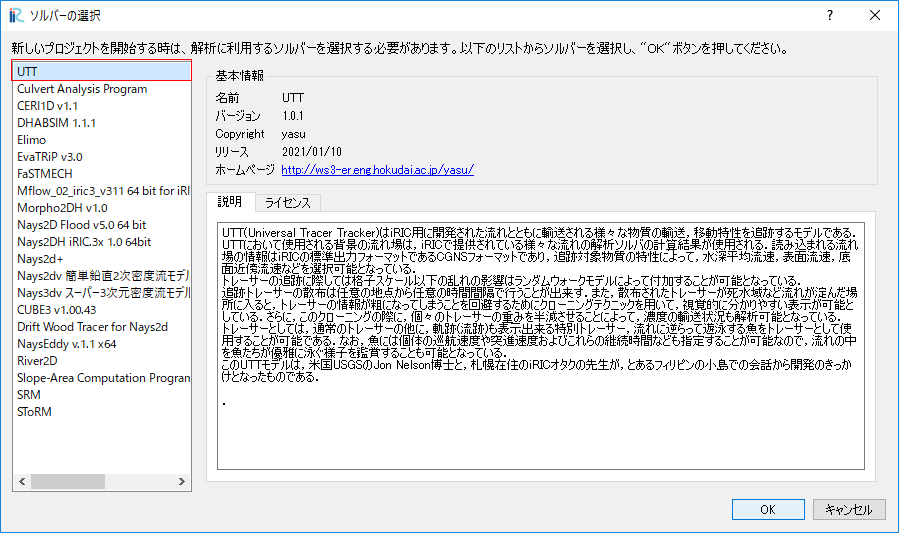
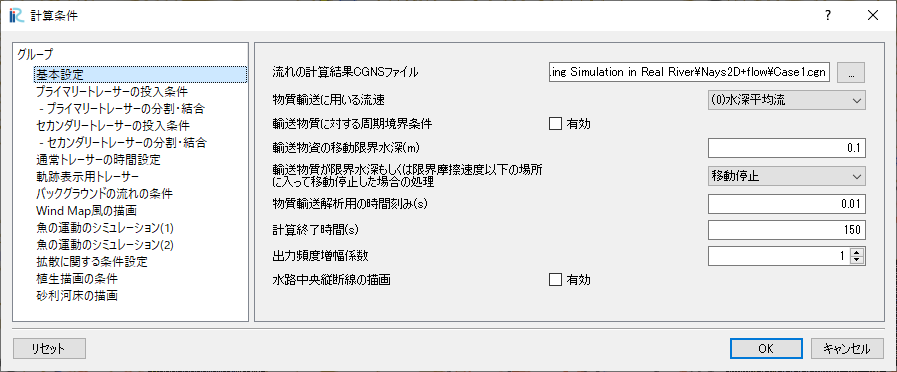
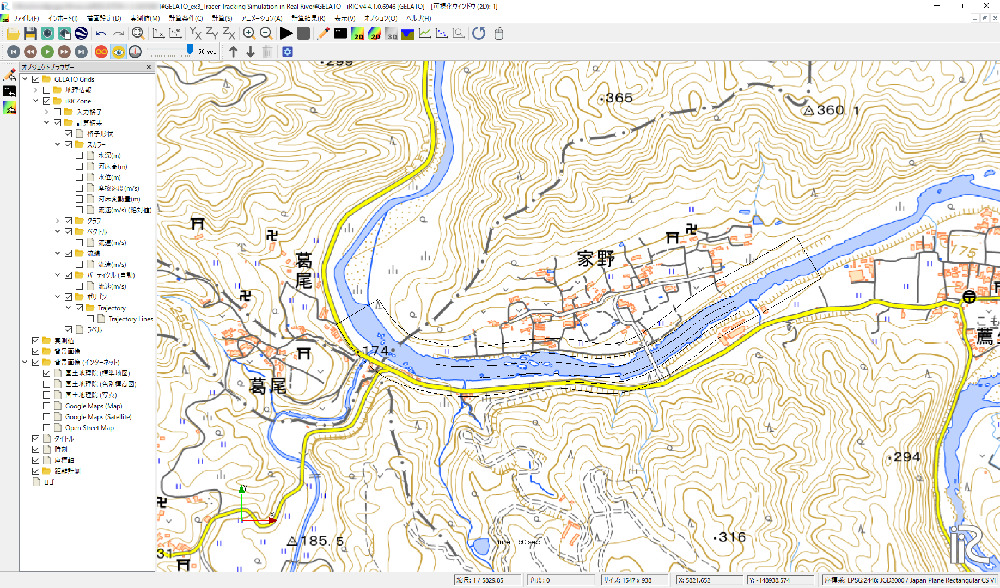
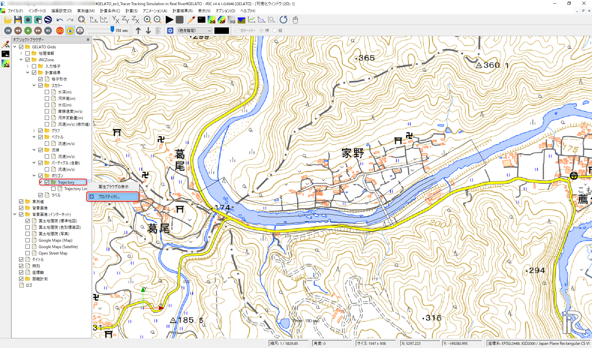
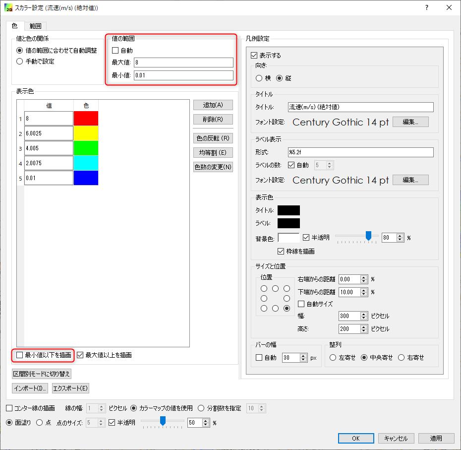

==========================================================
[Example 3] Tracer Tracking Simulation in Real River
==========================================================

In this section, we perform s simulation of tracking floats for
the discharge measurements in a real river.
Floats are injected from a bridge and velocities are calculated by 
measuring the flow time between two sections ste up with 100m interval in which 
the upper section is located 130m downstream of the bridge. 
Using a discharge of 384m :math:`^3`/s, flow calculation is conducted using
Nays2d+, and the paths of the floats are simulated by GELATO.

Flow Calculation by Nays2d+
==============================

Selection of Solver
-----------------------

From the start window of the iRIC, launch [Nays2d+] as :numref:`03_001`.

.. _03_001:

.. figure:: images/03/001.png
   :align: center
   :width: 600pt

   : Solver Selection

Import Geometric Data and Making Computational Grid
-----------------------------------------------------------

Importing River Bed Elevation Data
^^^^^^^^^^^^^^^^^^^^^^^^^^^^^^^^^^^^^^^^^

From the main menu, select [Import]->[Geographic Data]->[Bed Elevation(m)] as
:numref:`03_002`, and read "tikei.tpo (Point Claud Data)" as shown in 
:numref:`03_003`. 

.. _03_002:

.. figure:: images/03/002.png
   :align: center
   :width: 100%

   : Import River Bed Data File

.. _03_003:

   : Selecting a tpo file

While reading the data, you need to set filtering value as 
:numref:`03_004`.  In this example, choose [1] just for without filtering.

.. _03_004:

.. figure:: images/03/004.png
   :align: center
   :width: 400pt

   : Input Filtering Value

The geometric data (ground elevation data) is shown as 
:numref:`03_005`.

.. _03_005:

.. figure:: images/03/005.png
   :align: center
   :width: 100%

   : Geometric Data

Setup Background image
^^^^^^^^^^^^^^^^^^^^^^^^^^^^^^^

From the main menu, select [File]->[Property], and press [Edit] button at
[Coordinate System:] information as :numref:`03_006`.

.. _03_006:

.. figure:: images/03/006.png
   :align: center
   :width: 400pt

   : Project Property

in the [Select Coordinate System] window, type "Japan" at [Search:] box, and select 
[EPSG ..... Japan .... IV] from the list below the [Search:] box, and press [OK] as
:numref:`03_007`.  Then close the [Project Property] window by pressing [Close].

.. _03_007:

.. figure:: images/03/007.png
   :align: center
   :width: 400pt

   : Select Coordinate System

In the [Object Browser], put check marks at [Background Images (Internet)]
->[国土地理院(標準地図)] as :numref:`03_008`.

.. _03_008:

   :Select Background Image 

Grid Creation
^^^^^^^^^^^^^^^^^^^^^^^^^

From the main menu, select [Grid]->[Select Algorithm to Create Grid], and
select [Create grid from polygonal line and width] in the next window
(:numref:`03_009`)

.. _03_009:

.. figure:: images/03/009.png
   :align: center
   :width: 600pt

   : Select Grid Creating Algorithm

Assign channel center points from the upstream side to down stream side as :numref:`03_010`.
上流側から下流へ向けて中心位置を選択する. 

.. _03_010:

.. figure:: images/03/010.png
   :align: center
   :width: 100%

   : Assign Center Points 

In the [Grid Creation] window, :numref:`03_011`, input values as 
Ni=200, Nj=60 and W=120, then the grid size becomes about 3.2mx2m as :numref:`03_012`.

.. _03_011:

   : Grid Creation

.. _03_012:

   : Created Grid Shape

Setup for Bridge Piers
^^^^^^^^^^^^^^^^^^^^^^^^^

From the [Object Browser] in the left side of the window, hide the [Point Cloud Data 1] by removing 
the check mark.  Right click [Obstacles], select [Add]->[Polygons], and make polygons by clicking the 
outer edge of the piers, and assign them as [Obstacle] (:numref:`03_013`)
Surround all the cells in one polygon and assign it as [Normal Cell].  Note that the [Normal Cell] 
polygon has to be located at lower layer than the [Obstacle] polygons (:numref:`03_014`).

.. _03_013:

   :Obstacle Cells for Bridge Piers

.. _03_014:

.. figure:: images/03/014.png
   :align: center
   :width: 100%

   :Normal Cells for All the Area

Set Manning's Roughness Coefficient
^^^^^^^^^^^^^^^^^^^^^^^^^^^^^^^^^^^^^^^

[マニングの粗度係数]よりポリゴンから全格子囲みn=0.030を入力する. 

In the [Object Browser] under the group of [Geographic Data], right click 
[Manning's roughness coefficient] and select [Add]->[Polygons], and 
make a polygon covering all the grid domain, and input n=0.030
(:numref:`03_015`).

.. _03_015:

.. figure:: images/03/015.png
   :align: center
   :width: 400pt

   :Set Manning's Roughness Coefficient

Attributes Mapping
^^^^^^^^^^^^^^^^^^^^^^^^^

From the main menu, select [Grid]->[Attributes Mapping]->[Execute]
(:numref:`03_016`).

.. _03_016:

.. figure:: images/03/016.png
   :align: center
   :width: 100%

   :Select Attributes Mapping

Put check marks at [Elevation(m)], [Obstacle] and  [Maninng's roughness coefficient] in
the [Attribute Mapping] window as :numref:`03_017`, and press [OK] to execute mapping.

.. _03_017:

.. figure:: images/03/017.png
   :align: center
   :width: 250pt

   :Choose Mapping Items and Execute Mapping

Set Calculation Condition
-----------------------------
                                 
From the main menu, select [calculation Condition]->[Setting], and
input parameters in the [Calculation Condition] window as the following figures of
:numref:`03_018`, :numref:`03_019`,  :numref:`03_020`,  :numref:`03_021`,  :numref:`03_022`
and :numref:`03_023`.  When you finished to input parameters, press [Save and Close].

.. _03_018:

   :Discharge and downstream water surface elevation settings

.. _03_019:
   
.. figure:: images/03/019.png
   :align: center
   :width: 100%

   :Time series of discharge and downstream stage                             

.. _03_020:  

   :Time and bed erosion parameters     

.. _03_021:
   
.. figure:: images/03/021.png
   :align: center
   :width: 100%

   :Boundary Condition      

.. _03_022:
   
.. figure:: images/03/022.png
   :align: center
   :width: 100%

   :Other computational condition     

.. _03_023:
   
.. figure:: images/03/023.png
   :align: center
   :width: 100%

   :3D Velocity Profile     

Execute a Solver
---------------------

Save the project with some name, and run the solver by [Simulation]->[Run].
When the simulation finished, save the results and close the project.

Tracking Virtual Tracers by GELATO
=====================================

Select a Solver
---------------------

In the [Select Solver] window, which appears when you select [Create New Project]
in the startup window of the iRIC,  select [GELATO] and press [OK] as
:numref:`03_024`.

.. _03_024:

   

   :Select GELATO Solve     

Import Grid Data
---------------------

Right click [Grid(No Data)] in the [Object Browser] and select [Import] as
:numref:`03_025`.

.. _03_025:
   
.. figure:: images/03/025.png
   :align: center
   :width: 100%

   :Select GELATO     

Choose [Case1.cgn] which contains the calculation results of [Nays2d+] saved
in the previous section (:numref:`03_026`)

.. _03_026:

.. figure:: images/03/026.png
   :align: center
   :width: 600pt

   : Select a File to Import

Confirmation of Geographic Data
--------------------------------------

Set coordinate system by selecting [File]->[Property] from the main menu as
:numref:`03_027`.

.. _03_027:

.. figure:: images/03/027.png
   :align: center
   :width: 100%

   :Select Property

In the [Project Property] window, press [Edit] located at the [Coordinate System:] lin
(:numref:`03_028`)

.. _03_028:

   :Project Property

Type "Japan" in the box next to [Search:], select a line with [ EPSG:...Japan....CS VI],
and press [OK] as :numref:`03_029`.

.. _03_029:
   
.. figure:: images/03/029.png
   :align: center
   :width: 400pt

   :Select Coordinate System

Select [Background Images(Internet)]->[国土地理院(標準地図)] from the Object Browser
as :numref:`03_030`.

.. _03_030:

   :Background Image

Tracer Tracking by GELATO
-----------------------------------

Calculation Condition
^^^^^^^^^^^^^^^^^^^^^^^^^

From the main menu, select [Calculation Condition]->[Setting],
and set the [Calculation Condition] as 
:numref:`03_031`, :numref:`03_032`, :numref:`03_033` and :numref:`03_034`.
In which the CGNS file to read in the :numref:`03_032` is usually the 
same file imported for calculation grid in :numref:`03_026`.

.. _03_031:

   :[Basic Settings]

.. _03_032:
  
.. figure:: images/03/032.png
   :align: center
   :width: 600pt

   :Set the CGNS file to read the flow field information

.. _03_033:
  
.. figure:: images/03/033.png
   :align: center
   :width: 600pt

   :Set special tracer information for path tracking

.. _03_034:

.. figure:: images/03/034.png
   :align: center
   :width: 600pt

   :Diffusion Condition

Execute Calculation
^^^^^^^^^^^^^^^^^^^^^^^^^

From the main menu, save thr project by selecting [File]->[Save Project as], and 
execute GELATO by selecting [Simulation]->[Run].

Visualization of the Calculation Results
^^^^^^^^^^^^^^^^^^^^^^^^^^^^^^^^^^^^^^^^^^^^^^

From the main menu, select [Calculation Result]->[Open new 2D Post-Processing Window].
Put check marks in [Background Images(Internet)] and [GSI(Ortho Images)(Japan only)] in the Object Browser, 
as :numref:`03_035`.

.. _03_035:

   :Show Background Image

Right click the [Trajectory] at the [Polygon] in the Object Browser, and select [Property] as 
:numref:`03_036`.

.. _03_036:

   :Property of the Polygon

In the [Polygon Setting] window, set [Line Width] as [3] as :numref:`03_037`.

.. _03_037:

.. figure:: images/03/037.png
   :align: center
   :width: 600pt

   :Polygon Setting

From the Object Browser, put check marks at [Scalar(node)] and [Velocity] 
and right click [Velocity] and press [Property].
In the [Scalar Setting] window, as shown :numref:`03_038`, uncheck [Automatic], set [Max:] and [Min:] vales, 
and uncheck [Fill lower area].

.. _03_038:

   :Scalar Setting

After above settings the calculation results of the tracers injected from the Bridge can be visualized as follows.

   :Tracer Tracking Paths

.. figure:: images/03/tracers.gif
   :align: center
   :width: 70%

   : Tracer Tracking Animation